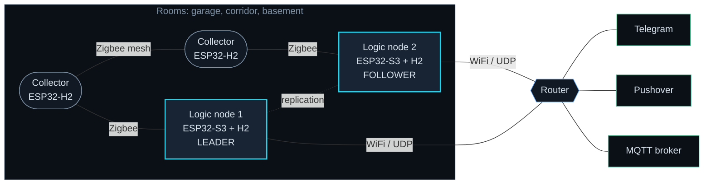
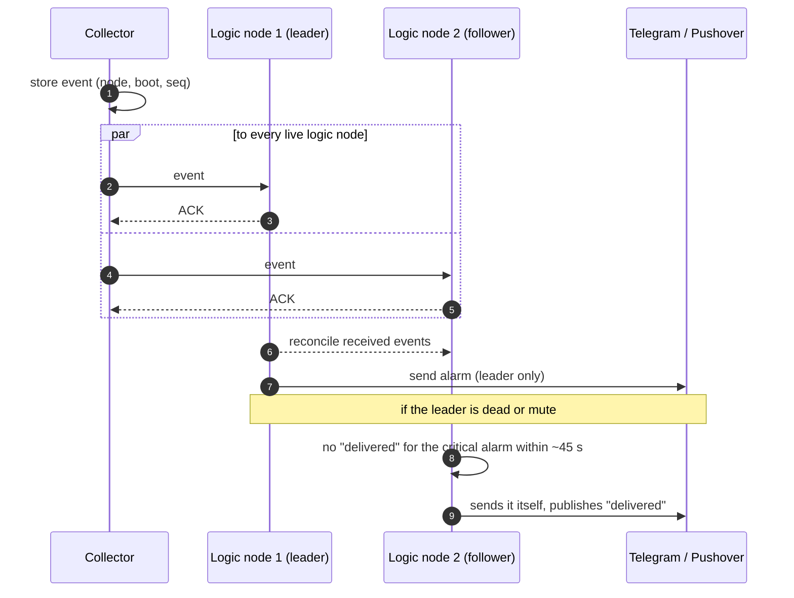
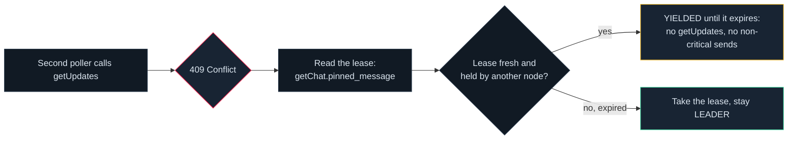
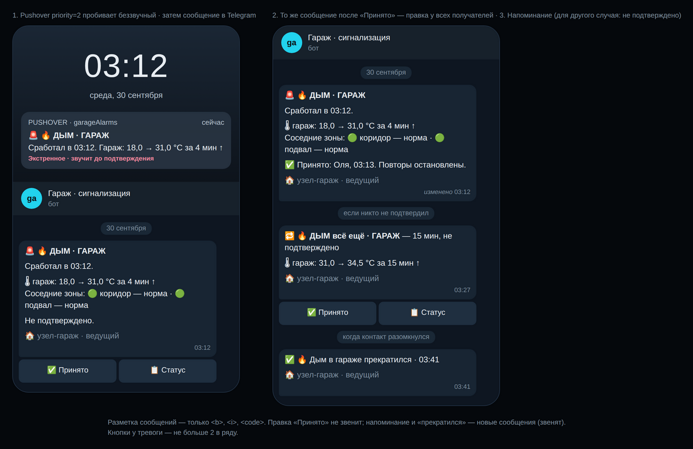
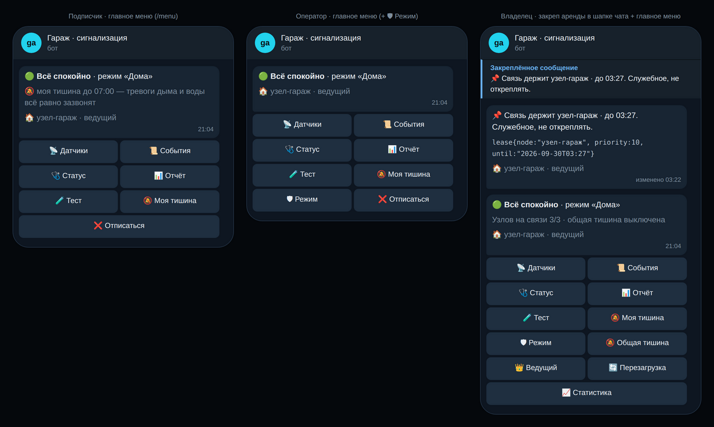
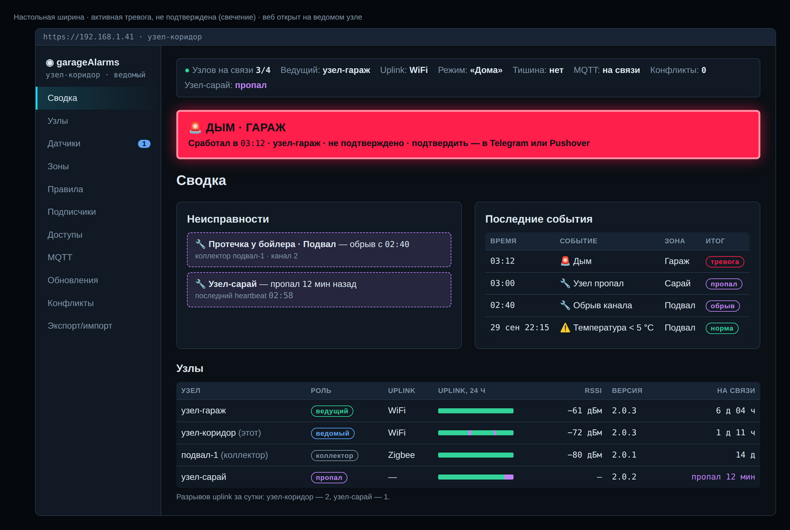
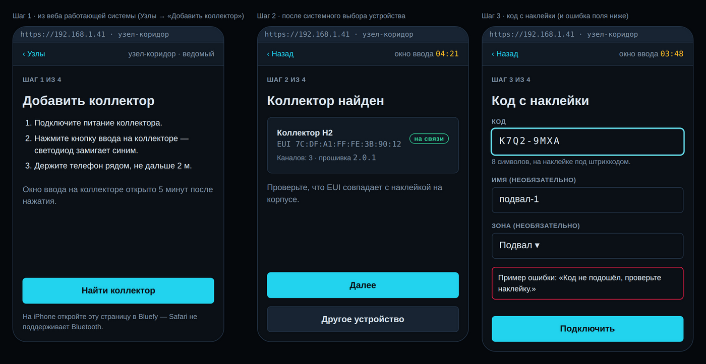

  

  
  
  
  
  
  
  

  <b>Alarms for a garage and the rooms next to it</b> — smoke, water, motion, temperature — 
  delivered to Telegram (and, in 2.0, to Pushover and MQTT).

  <a href="#why">Why</a> ·
  <a href="#concept-garagealarms-20">Concept</a> ·
  <a href="#how-an-alarm-survives-failures">Resilience</a> ·
  <a href="#screens">Screens</a> ·
  <a href="#features">Features</a> ·
  <a href="#architecture-at-a-glance">Architecture</a> ·
  <a href="#roadmap">Roadmap</a> ·
  <a href="#garagealarms-1x">1.x</a>

---

This repository is **garageAlarms 2.0**: a decentralized network of nodes that replaces the
single-box [garageAlarms 1.x](https://github.com/Lindenson/garageAlarms), which keeps guarding
the garage until epic 5. Planning is complete; implementation starts with epic 1.

## Why

> [!IMPORTANT]
> It is an alarm system, so the priorities are, in order:
> **1. never miss or silently drop an event** › **2. never flood the user** › **3. everything else.**
> Every decision in both versions is resolved against that ordering.

1.x serves that ordering well within one box — but the box itself is the limit:

| 1.x limitation | Consequence | 2.0 answer |
| --- | --- | --- |
| 📶 One device, one WiFi link | a weak router signal or a dead box silences the garage | 2+ logic nodes, Zigbee mesh, UDP second path, leader failover |
| ✂️ Inputs are pulled toward "quiet" | a cut wire looks exactly like "nothing happening" | end-of-line resistors: a cut or shorted loop is a fault |
| 🔌 Two fixed inputs | no water, temperature, CO₂, or sensors in other rooms | collectors in every room, sensor driver gateway |
| 💬 Telegram only | an alarm at 3 a.m. on a silenced phone is easy to sleep through | Pushover emergency alerts, repeating until acknowledged |
| 🧱 Logic is compiled in | no "water in two rooms", "motion garage → corridor", modes like "away" | nine rule templates with `when`, modes, chains, traces |

> [!NOTE]
> **2.0 exists to remove the single point of failure and add shared logic across rooms — without
> giving up the ordering above.** Duplicates are acceptable; losses are not.

## Concept: garageAlarms 2.0

A network of nodes in adjacent rooms, **with no central hub**.

<table>
<tr>
<td width="50%" valign="top">

### 🧠 Logic nodes

**2 or more** · ESP32-S3 with an ESP32-H2 as its Zigbee radio, FRAM for persistence.

- hold a full replica of the outbound queue, configuration and rules
- run **every** rule
- serve the local web UI
- one is the **leader** and talks to the outside world; the others shadow it and take over

</td>
<td width="50%" valign="top">

### 📡 Collectors

**ESP32-H2**

- read sensors and forward events over the Zigbee mesh
- relay for each other
- no logic of their own

</td>
</tr>
</table>

### How an alarm survives failures

| | Guarantee |
| :---: | --- |
| 🆔 | Every event carries a unique id `(node, boot, seq)`, is **stored before it is acknowledged**, and is retried to **every** live logic node until each confirms. Logic nodes also reconcile what they have received with each other. |
| 👑 | The leader is the live logic node with a working uplink, the best configured priority, then the lowest hardware id. |
| 🛟 | A follower that does not see a critical alarm marked as delivered within **~45 s** sends it itself. |
| 🔌 | Wires are supervised with end-of-line resistors, so a cut or shorted loop is a fault, not silence. Silent nodes and sensors raise health events. |
| 🔕 | Mute never silences a critical event. |

> [!TIP]
> **Success signal.** On the bench (2 logic nodes + 2 collectors), during a smoke alarm the leader's power,
> the router and one relaying collector are switched off in turn — the alarm reaches Telegram and Pushover
> every time within **60 s**, **with no losses and at most one duplicate**; a cut loop and a disconnected node
> raise their own fault events.

### ⚖️ Telegram as the arbiter

If the internal network splits and two nodes both think they lead, **Telegram decides**:

- Only the `LEADER` sends and long-polls `getUpdates`. It holds a **pinned message in the owner's chat** —
  the lease `lease{node, priority, until}` — and renews it before it expires.
- A `409 Conflict` means only "there is a second poller"; the lease decides who yields. Verified against the real Bot API.
- The update `offset` is stored and replicated **before** a command is executed, and executed `update_id`s are
  kept in a replicated set — a new leader never replays old commands.

## Screens

UX mockups in the dark **Cold Steel NOC** theme (bot and web text is Russian). Source:
[mockups](_bmad-output/planning-artifacts/ux-designs/ux-garageAlarms-2026-09-30/mockups/).

<table>
<tr>
<td width="50%" align="center">
  
   <b>Bot · alarm</b> — Pushover breaks through silent mode, «Принято» stops repeats everywhere
</td>
<td width="50%" align="center">
  
   <b>Bot · menu</b> — per-role menus; the owner's chat pins the leader lease
</td>
</tr>
<tr>
<td width="50%" align="center">
  
   <b>Web · summary</b> — active alarm, faults, recent events, nodes and uplink history
</td>
<td width="50%" align="center">
  
   <b>Web · add collector</b> — Web Bluetooth setup with the code from the sticker
</td>
</tr>
</table>

## Features

| | | |
| --- | --- | --- |
| 💬 **Telegram bot** Everyday use: status, sensors by zone, event history, «Принято» (ack) on alarms, modes (home / away / night), personal and global mute. Roles: owner, operator, subscriber. | 🚨 **Pushover** Emergency alerts for critical events to the whole family, repeating until someone acknowledges; an ack in any channel stops repeats everywhere. | 🖥️ **Local web UI** LAN only, HTTPS with the system's own CA: nodes, sensors, zones and their adjacency graph, rules, credentials, MQTT, updates. |
| 🧩 **Rules** Nine templates — threshold, rate of change, health, coincidence, chain, trace across zones, aggregation, action, mode/schedule — with an optional `when` condition. | 🌡️ **Sensor driver gateway** 1-Wire and I²C; a new sensor type is one driver file and a rebuild. Starting set: DS18B20, SHT3x/4x, BME280/680/688, SGP40/41, SCD40/41, BH1750, VEML7700, INA219, ADS1115, plus dry contacts and pulse counters. | 📤 **MQTT mirror** Optional output with its own bounded buffer — it can never push an alarm out of the main queue. |
| 🔄 **OTA** Every node, one at a time, with rollback; collectors via the Zigbee OTA cluster, logic nodes over UDP together with their H2 radio firmware. | 🔐 **Security** Own CA for HTTPS, every frame signed (HMAC), anti-replay, secrets in encrypted NVS, signed OTA images, secure boot v2 + flash encryption on production logic nodes. | 🛠️ **Setup** USB provisioning; a logic node via its own WiFi access point, a collector via Web Bluetooth (BLE Security 2, code on the sticker). |

## Architecture at a glance

**Stack:** ESP-IDF v6.0 + FreeRTOS, actor model (one task per layer, message passing),
esp-zigbee-lib 2.0 in distributed-security mode (no coordinator), CBOR between nodes, OTA for
every node one at a time with rollback. Model AP: availability over consistency — a duplicate is
acceptable, a loss is not.

Every actor is a FreeRTOS task, the sole owner of its state, talking only through messages on its
input queue. Two node classes run different subsets of the same stack:

| Layer | Actor | Owns | Logic node S3 + H2 | Collector H2 |
| :---: | --- | --- | :---: | :---: |
| L1 | `Mesh` | Zigbee stack, UDP transport, framing, channel choice | ✅ | ✅ Zigbee only |
| L2 | `Delivery` | ACK, retry, anti-replay, dedup, unacked buffer, replication of source events | ✅ | ✅ |
| L3 | `Membership` | live-node table, heartbeat, leader computation | ✅ | ✅ no leader |
| L4 | `Config` | soft config, rules, subscribers, modes, versions, merge | ✅ | — |
| L5 | `Rules` | rule execution, windows, derived events | ✅ | — |
| ext | `Notify` · `Ui` | outbound queue, Telegram, Pushover, MQTT · web UI and commands | ✅ | — |
| — | `Sensor` · `Sys` · `Storage` | drivers and channels · OTA, watchdog, time, provisioning · FRAM / NVS | ✅ | ✅ |

25 binding decisions (AD-1…AD-25) are recorded in the
[architecture spine](_bmad-output/planning-artifacts/architecture/architecture-garageAlarms-2026-09-29/ARCHITECTURE-SPINE.md).

## Roadmap

Nine epics, 67 stories. Each epic delivers something that works on its own.

| | # | Epic | Stories | Outcome |
| :---: | :---: | --- | :---: | --- |
| 🟡 | 1 | Prototype confirms the hardware | 7 | S3 ↔ H2 radio link, Zigbee without a coordinator, loss under WiFi load, Zigbee OTA from a router — measured before building on them |
| ⚪ | 2 | First alarm through the network | 6 | dry contact on a collector → mesh → logic node → FRAM → Telegram; USB provisioning, encrypted secrets, signed frames |
| ⚪ | 3 | No single point of failure | 11 | two logic nodes, heartbeat, leader and Telegram lease, replication, UDP second path, critical-alarm backup; bench chaos test |
| ⚪ | 4 | Notification and acknowledgement | 7 | full Telegram UI, Pushover until acknowledged, shared ack, daily report, reboot notices |
| 🏁 | 5 | OTA, secure setup, **replacing 1.x** | 7 | OTA for all nodes, phone-based setup, secure boot for production nodes, end-of-line loops; acceptance test, then 1.x is switched off |
| ⚪ | 6 | Local web configuration | 7 | nodes, sensors, zones, leadership, subscribers, conflicts, export/import |
| ⚪ | 7 | Sensors and their health | 10 | channel model, driver gateway and starting set, 12 V and 220 V supervision |
| ⚪ | 8 | Rules and shared logic | 9 | nine templates, `when`, modes, chains, coincidences, traces, rule editor |
| ⚪ | 9 | MQTT mirror | 3 | events, states and health to the user's broker |

🟡 next up · ⚪ planned · 🏁 milestone: 1.x is switched off after epic 5

> [!NOTE]
> **Status (2026-09-30):** planning complete; prototype hardware ordered
> ([bill of materials](_bmad-output/planning-artifacts/bill-of-materials.md)). Stories 1.1 and
> 1.2 need no hardware and can start now. The 1.x box stays in service until epic 5.

### Planning documents

All planning was done with the BMad method and lives under `_bmad-output/` (in Russian):

| Document | What it fixes |
| --- | --- |
| 💡 [Idea: device network](_bmad-output/forge/garage-device-network/forged-idea.md) | decentralized AP model, node classes, Telegram arbiter |
| 💡 [Idea: rules and config](_bmad-output/forge/rules-config-model/forged-idea.md) | configuration levels, channel model, rule templates |
| 🏛️ [Architecture spine](_bmad-output/planning-artifacts/architecture/architecture-garageAlarms-2026-09-29/ARCHITECTURE-SPINE.md) | 25 binding decisions (AD-1…AD-25) |
| 📜 [Specification](_bmad-output/specs/spec-garage-alarms-2/SPEC.md) | 13 capabilities, constraints, non-goals, success signal + companions: [external channels](_bmad-output/specs/spec-garage-alarms-2/external-channels.md) · [sensor catalog](_bmad-output/specs/spec-garage-alarms-2/sensor-catalog.md) · [rule templates](_bmad-output/specs/spec-garage-alarms-2/rule-templates.md) · [glossary](_bmad-output/specs/spec-garage-alarms-2/glossary.md) |
| 🎨 [UX: design](_bmad-output/planning-artifacts/ux-designs/ux-garageAlarms-2026-09-30/DESIGN.md) · [UX: experience](_bmad-output/planning-artifacts/ux-designs/ux-garageAlarms-2026-09-30/EXPERIENCE.md) | dark "Cold Steel" theme, bot menus, web sections, setup flows, mockups |
| 🗂️ [Epics and stories](_bmad-output/planning-artifacts/epics.md) | 36 FR, 12 NFR, 69 UX requirements, 9 epics, 67 stories |
| 🧾 [Bill of materials](_bmad-output/planning-artifacts/bill-of-materials.md) | prototype bench: 2 logic nodes + 2 collectors |

---
## garageAlarms 1.x

The current single-box firmware (one ESP32-S3, two dry contacts, a Telegram bot) lives in
[Lindenson/garageAlarms](https://github.com/Lindenson/garageAlarms). Its lessons — bounded
waits, time-based debounce, a queue that deletes only after success, rate-limited reboot
notices — are carried into 2.0 as architecture rules; see
[brownfield.md](_bmad-output/specs/spec-garage-alarms-2/brownfield.md).

## License

[MIT](LICENSE).
