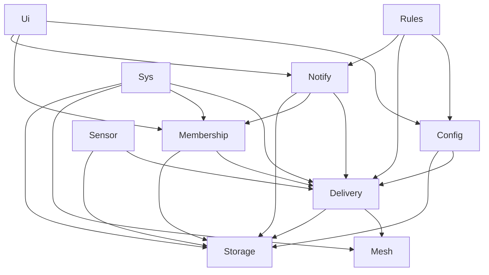
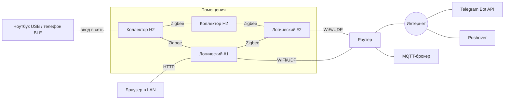

# Architecture Spine — garageAlarms 2.0

Приоритеты: **не потерять событие > не флудить > остальное.** Модель AP: доступность важнее согласованности, дубль допустим, потеря — нет.

## Design Paradigm

**Акторы поверх слоёного стека протоколов.** Каждый актор — задача FreeRTOS, единственный владелец своего состояния, общается только сообщениями через свою входную очередь.

| Актор | Слой | Владеет | Логический | Коллектор (H2) |
| --- | --- | --- | --- | --- |
| `Sensor` | драйверы | драйверы, каналы, сбор, антидребезг, кэш параметров своих каналов | ✔ | ✔ |
| `Mesh` | L1 | Zigbee-стек, UDP-транспорт, кадрирование, выбор канала | ✔ | ✔ (только Zigbee) |
| `Delivery` | L2 | ACK, повтор, антиповтор, дедуп, буфер неподтверждённых, репликация исходных событий | ✔ | ✔ |
| `Membership` | L3 | таблица живых узлов, heartbeat, вычисление лидера | ✔ | ✔ (без лидера) |
| `Config` | L4 | мягкий конфиг, правила, подписчики, режимы, версии, слияние | ✔ | — |
| `Rules` | L5 | исполнение правил, окна, производные события | ✔ | — |
| `Notify` | внешний | исходящая очередь, Telegram (отправка и `getUpdates`), Pushover, receipts, `offset`, MQTT-зеркало и его буфер | ✔ | — |
| `Ui` | внешний | веб-интерфейс, разбор и исполнение команд | ✔ | — |
| `Sys` | сквозной | OTA, watchdog, время, самодиагностика, ввод в сеть | ✔ | ✔ |
| `Storage` | сервис | FRAM (логический) / NVS (коллектор) | ✔ | ✔ |



Стрелка = «может отправлять запрос». Обратное направление — только события по подписке (так `Notify` передаёт команды из `getUpdates` в `Ui`, `Delivery` — входящие события в `Rules`, `Config` — параметры каналов в `Sensor`).

## Invariants & Rules

### AD-1 — Актор — единственный владелец своего состояния [ADOPTED]
- **Binds:** all
- **Prevents:** два модуля одновременно правят очередь/конфиг; гонки под мьютексами.
- **Rule:** Состояние актора недоступно другим ни по указателю, ни через глобальные переменные. Взаимодействие — только сообщения в очередь актора. Мьютекс допустим лишь внутри одного актора.

### AD-2 — Направление зависимостей
- **Binds:** all
- **Prevents:** циклы между слоями; нижний слой, знающий о правилах или Telegram.
- **Rule:** Запросы идут только по стрелкам диаграммы Paradigm. Вверх и между акторами одного уровня — только события по подписке. `Storage` ни от кого не зависит. Все события, включая события датчиков самого логического узла, проходят через `Delivery` — у `Rules` один вход.

### AD-3 — Никакого ожидания без границы
- **Binds:** all
- **Prevents:** зависание задачи → watchdog → перезагрузочная петля (урок 1.x).
- **Rule:** Каждое ожидание (сеть, шина, очередь, TLS) ограничено таймаутом «без прогресса». Блокирующий TLS — только в задаче `Notify`. Каждая задача зарегистрирована в task watchdog. TLS не начинается до синхронизации времени.

### AD-4 — `Storage` — единственный доступ к постоянной памяти; запись до подтверждения [ADOPTED]
- **Binds:** Storage, Sensor, Delivery, Notify, Config, Membership, Sys
- **Prevents:** два писателя FRAM; подтверждение того, что ещё не сохранено.
- **Rule:** К FRAM (логический) и NVS (коллектор) обращается только `Storage`. ACK на событие и приём исходящего элемента — только после подтверждения записи от `Storage`. FRAM — на своей шине, не общей с датчиками (SPI предпочтительно), ≥ 256 КБ.

### AD-5 — `components/proto` — единственный источник протокола; подпись по сырым байтам [ADOPTED]
- **Binds:** все межузловые сообщения, обе прошивки
- **Prevents:** разное кодирование; узел N−1 ломает подпись сообщения узла N при перекодировании.
- **Rule:** Конверт, ID, HMAC, типы, классы трафика и версии протокола определены только в `components/proto`, обе прошивки собирают его. Кадр = CBOR-массив `[body, kid, m]`: `body` — байтовая строка с CBOR-картой, `kid` — номер ключа сети, `m` — HMAC ключом `kid` над байтами `body`. При смене ключа узлы в течение переходного периода принимают старый и новый `kid`, подписывают новым. Подпись проверяется до декодирования; пересылающий узел передаёт `body` байт в байт и никогда не перекодирует. Карта `body`: `v` (версия), `t` (тип), `c` (класс трафика), `k` (критичность), `n` (EUI-64), `b` (boot), `q` (seq), `ts`, `p` (нагрузка). Ключи короткие; незнакомые поля и типы пропускаются. Сообщение состояния канала укладывается в один Zigbee-кадр.

### AD-6 — Совместимость версий N и N−1
- **Binds:** proto, OTA, Rules
- **Prevents:** поэтапное OTA ломает сеть, где живут разные версии.
- **Rule:** Версия протокола N понимает N−1. Поля не удаляются и не меняют смысл внутри мажорной версии. Событие незнакомого типа подтверждается, хранится и реплицируется как непрозрачный `body`; маршрутизация и критичность берутся из полей `c` и `k`, а не из типа. Экземпляр правила с незнакомым шаблоном не исполняется и помечается в вебе.

### AD-7 — Идентичность [ADOPTED]
- **Binds:** proto, Membership, Config, Delivery, Rules
- **Prevents:** потеря настроек после перепрошивки; события после перезагрузки выброшены как дубли; разные ID одного производного события.
- **Rule:** ID узла = EUI-64 Zigbee. ID события = `(node, boot, seq)`; `boot` — постоянный счётчик, увеличивается и сохраняется до первой отправки; `seq` с 0 в каждой загрузке, один счётчик на все исходящие сообщения узла. Производное событие: `(rule_id, window_start)`, где `window_start = floor(ts_источника / длина_окна) × длина_окна`. `channel_id` и `rule_id` присваивает `Config` при создании и не переиспользует. Мягкий конфиг привязан к EUI-64 и `channel_id`.

### AD-8 — Доставка «хотя бы один раз» [ADOPTED]
- **Binds:** Delivery, Notify, Sensor
- **Prevents:** потеря события; логические узлы считают правила по разным входам.
- **Rule:** Коллектор отправляет событие каждому логическому узлу, который `Membership` считает живым, и повторяет каждому до его ACK или до объявления узла мёртвым. Логические узлы дополнительно обмениваются исходными событиями между собой (сводка «`(node, boot)` → принятые `seq`», запрос недостающих). Буфер коллектора разделён: события-фронты хранятся до ACK всегда; снимки состояния хранят только последнее значение канала. При переполнении вытесняется старейшее некритичное; критичное не вытесняется и не удаляется по числу попыток.

### AD-9 — Лидерство [ADOPTED]
- **Binds:** Membership, Notify, Ui
- **Prevents:** лидер без связи наружу; качание лидерства; узлы видят разные входы выбора.
- **Rule:** Каждый логический узел вычисляет лидера сам по данным heartbeat: среди логических узлов со здоровым uplink — минимальный `leader_priority`, затем минимальный EUI-64. Состояние uplink и `uplink_since` сообщает сам узел-источник в heartbeat; uplink бинарный с гистерезисом N/M. Лучший по приоритету узел возвращает лидерство только при `uplink_since` ≥ 15 мин. Ручное назначение — запись `leader_override{node, until}` в мягком конфиге, действует сразу до `until` или отмены. Статусы: `LEADER` / `FOLLOWER` / `YIELDED` (AD-10) / `ISOLATED` (нет пиров и нет uplink: только копит). Узел без пиров, но с uplink — `LEADER`.

### AD-10 — Внешняя отправка и конфликт лидеров
- **Binds:** Notify, Ui, Membership
- **Prevents:** дубли от двух отправителей; повтор старых команд новым лидером.
- **Rule:** Наружу отправляет и `getUpdates` (long polling) делает только `LEADER`. `LEADER` держит в чате владельца закреплённое сообщение-аренду `lease{node, priority, until}` и продлевает его до истечения. 409 на `getUpdates` означает только «есть второй опрашивающий»: узел читает аренду через `getChat.pinned_message`; если она свежая и принадлежит другому узлу — `YIELDED` до её истечения; если просрочена — забирает её. Без доступной аренды — `YIELDED` на `base × (1 + ранг)`. В `YIELDED` нет `getUpdates` и некритичной отправки. `offset` сохраняется и реплицируется **до** исполнения команды; выполненные `update_id` хранятся в реплицируемом множестве, команда с известным `update_id` не исполняется. Узел, ставший `LEADER`, принимает отправку всех недоставленных элементов.

### AD-11 — Страховка критичного [ADOPTED]
- **Binds:** Notify, Membership
- **Prevents:** тревога застряла у живого, но немого лидера.
- **Rule:** `FOLLOWER`, не увидевший `delivered` по всем единицам доставки критичного события за T (~45 с), отправляет недоставленные единицы сам и публикует `delivered`. Mute никогда не глушит критичное.

### AD-12 — Выбор канала по классу трафика [ADOPTED]
- **Binds:** Mesh, Delivery, proto
- **Prevents:** объёмный трафик душит Zigbee-mesh; модули сами выбирают транспорт.
- **Rule:** Канал выбирает только `Mesh` по полю `c`: `sensor` — Zigbee; `critical` (тревоги, ACK, `delivered`, `ack`, heartbeat) — Zigbee и UDP одновременно; `bulk` (синхронизация конфига и исходных событий, OTA логических узлов) — UDP, по Zigbee только при недоступности UDP и с ограничением скорости. Zigbee-радио скрыто за интерфейсом `Mesh`: на логическом узле это H2 как RCP по UART, на коллекторе — нативный стек H2.

### AD-13 — Zigbee без координатора
- **Binds:** Mesh, Sys
- **Prevents:** Zigbee-координатор как скрытый хаб.
- **Rule:** Zigbee-сеть работает в режиме distributed security; все узлы от сети питания — роутеры. Параметры сети и ключ приходят при вводе в сеть (AD-17).

### AD-14 — Уровни конфигурации и владелец [ADOPTED]
- **Binds:** Config, Sensor, Rules, Ui, Notify
- **Prevents:** одна настройка с двумя владельцами; воскрешение удалённого при слиянии; расхождение критичности.
- **Rule:** H (прошивка): манифест датчиков, драйверы, шаблоны правил. S (мягкий): имена, зоны, назначение и `criticality` каналов, интервалы, пороги, экземпляры и наборы правил (`severity`), режимы, граф зон, `leader_priority`, `leader_override`, подписчики и владелец, окно mute, маршрутизация уведомлений. R (рантайм): значения, здоровье. Писатель S — только `Config`; версия на ключ, слияние LWW по HLC `(wall_ms, counter, EUI-64)`; удаление — надгробие, не стирание. Конфликт одновременных правок одного ключа показывается в вебе. Критичность события ставит узел-источник в поле `k` по своей копии конфига; получатели её не пересчитывают. Коллектор получает параметры своих каналов событием от `Config` и хранит копию через `Storage`.

### AD-15 — Каналы и датчики [ADOPTED]
- **Binds:** Sensor, proto, Rules
- **Prevents:** правила, завязанные на конкретный датчик; ручная привязка пинов из веба.
- **Rule:** Единица модели — канал: `binary | numeric | counter | enum`, единица, диапазон, `health: ok|fault|open|short|stale`. Привязка к железу — только манифест прошивки. Драйверы датчиков — плагины с общим интерфейсом (шина, возможные адреса, `probe`, список каналов, чтение, опрос) в реестре, заполняемом при компиляции; новый датчик = файл драйвера + перекомпиляция, ядро не меняется. Автообнаружение перебирает только скомпилированные драйверы (1-Wire по ROM ID; I²C по адресу + `probe` с чтением ID/поведения); при совпадении адресов у разных драйверов решает `probe`, неоднозначное не регистрируется. I²C — только внутри корпуса; выносные — 1-Wire. Сбор: антидребезг по времени с cooldown; прогрев только для PIR. Узел публикует описание каналов (по смене версии) и состояние (по изменению и периодически).

### AD-16 — Правила считают только логические узлы, все [ADOPTED]
- **Binds:** Rules, Sensor, Delivery
- **Prevents:** правило срабатывает на одном логическом узле и не на другом; коллектор с логикой.
- **Rule:** Коллектор правил не исполняет. Все экземпляры правил исполняются на каждом логическом узле детерминированно из одного и того же множества исходных событий (AD-8) по `ts` источника. Состояние окон производное: после перезагрузки восстанавливается из хранимых исходных событий за длину самого длинного окна. Правило = шаблон + экземпляр + необязательное `when` (и/или/не, сравнения, режим, время, состояние; без циклов и переменных), проверяемое при сохранении. Команды правил (опросить, burst-интервал) несут ID и TTL и откатываются сами.

### AD-17 — Безопасность сети и ввод узла [ADOPTED]
- **Binds:** proto, Delivery, Mesh, Storage, Sys
- **Prevents:** подделка/повтор сообщений; кража токенов с флеша; чужая прошивка.
- **Rule:** Каждый кадр подписан HMAC ключом сети (AD-5). Антиповтор: `boot` не меньше последнего известного для узла; внутри `(node, boot)` — битовая карта принятых `seq`; повтор уже принятого события получает ACK заново и дальше не передаётся. Секреты — только в зашифрованном NVS. Логические узлы в серийном исполнении — secure boot v2 (RSA-3072) + flash encryption. OTA-образ принимается только с валидной подписью. Ввод: USB (раздел секретов), для логического узла — собственная WiFi-точка (SoftAP), для коллектора — BLE (Security 2, веб-страница через Web Bluetooth); окно ограничено и открыто только пока Zigbee-стек не запущен; все способы пишут одну запись provisioning в один namespace.

### AD-18 — OTA по одному узлу с откатом
- **Binds:** Sys, Mesh
- **Prevents:** одновременное обновление кладёт сеть; прошивка-кирпич.
- **Rule:** Одновременно обновляется не больше одного узла. Логические — по UDP (образ загружают через веб), вместе с RCP-прошивкой своего H2. Коллекторы — по Zigbee OTA Upgrade cluster, сервер — `LEADER`. Новая прошивка подтверждает себя только после входа в сеть, иначе откат.

### AD-19 — Живость и самодиагностика
- **Binds:** Membership, Sensor, Rules, Delivery
- **Prevents:** мёртвый узел или датчик выглядит как «тихо»; коллектор не знает, кому слать.
- **Rule:** Heartbeat несёт роль, статус, uplink и `uplink_since`, `leader_priority`, сводку версий конфига, здоровье каналов и время отправителя. Коллектор узнаёт список логических узлов только из heartbeat. Пропавший узел, канал в `stale`/`open`/`short` — событие шаблона «здоровье»; для критичного канала — критичное. Ежедневный heartbeat-отчёт владельцу делает молчание значимым.

### AD-20 — Время
- **Binds:** Sys, Rules, Config, Sensor
- **Prevents:** окна считаются по несогласованным часам.
- **Rule:** Логические узлы синхронизируются по NTP; без NTP источник времени — `LEADER`. Коллектор берёт время из heartbeat логических узлов. `ts` события ставит узел-источник. Слияние конфига — по HLC, не по голым часам.

### AD-21 — Единица доставки и подтверждение человеком
- **Binds:** Notify, Delivery, Config
- **Prevents:** `delivered` для одного чата гасит отправку остальным; подтверждение в одном канале не останавливает повторы в другом.
- **Rule:** Единица доставки — `(event_id, recipient, channel)`. `delivered` публикует тот узел, который отправил, по каждой единице; исходящий элемент удаляется, когда все единицы доставлены или окончательно отклонены. Pushover получает только критичные события, `priority=2`, `tag = event_id`; лишние копии отменяются `cancel_by_tag`. Подтверждение человеком в любом канале — реплицируемое событие `ack{event_id, by}`, оно гасит повторы во всех каналах.

### AD-22 — Внешние каналы и права
- **Binds:** Notify, Ui, Config
- **Prevents:** новый лидер не знает, кому слать; изменение критичного правила из Telegram.
- **Rule:** Подписчики, владелец и окно mute — в мягком конфиге. Подписка — по PIN; владельца отписать нельзя; команды принимаются только от подписанных чатов, опасные (перезагрузка, лидер) — только от владельца и с подтверждением. Telegram умеет: статус (с лидером и узлами), отчёты, тест, подтверждение, mute некритичного, `/leader`. Правила и конфиг — только локальный веб; критичное правило выключается только там и только временно (≤ N ч), с событием всем подписчикам. Каждое сообщение подписано узлом-отправителем и его статусом. Уведомления о перезагрузке — только владельцу, с причиной сброса и ограничением частоты. Между отправками в Telegram выдерживается пауза.

### AD-23 — Эксплуатация и секреты
- **Binds:** Sys, Config, Ui, Storage
- **Prevents:** токен бота гуляет по сети; нельзя заменить узел; конфиг теряется с последним узлом.
- **Rule:** Внешние секреты (токен Telegram, ключи Pushover, логин MQTT, логин и пароль веба) не передаются между узлами — каждый логический узел получает их при вводе или в своём веб-интерфейсе, который работает только по HTTPS; сертификаты узлов подписывает собственный CA системы, корневой сертификат ставится на телефоны. Пакет ключей для нового узла шифруется кодом с его наклейки, одноразовый, действует 30 мин. Ключи dev и prod разные. Веб умеет экспорт и импорт мягкого конфига (файл) и «забыть узел» (надгробие в `Membership`/`Config`). Замена секрета — повторный ввод узла.

### AD-24 — MQTT-зеркало с отдельным буфером [ADOPTED]
- **Binds:** Notify, Storage, Config, Ui
- **Prevents:** недоступный брокер вытесняет тревоги из основной очереди; MQTT становится обходным путём управления.
- **Rule:** MQTT — только выход: публикует `LEADER`, JSON с `event_id`, QoS 1. Темы: `<prefix>/<node>/<channel>/state` (retained), `<prefix>/events`, `<prefix>/<node>/health`. Подписок на команды нет. Буфер MQTT — отдельная ограниченная область FRAM через `Storage`, не общая с исходящей очередью; при переполнении вытесняется его старейший элемент. MQTT не входит в единицы доставки AD-21 и не задерживает удаление исходящего элемента. Адрес, порт, TLS, префикс, «включено» — мягкий конфиг; логин и пароль — секрет узла (AD-23), вводится в локальном вебе каждого логического узла.

### AD-25 — Единый файл констант
- **Binds:** all
- **Prevents:** одна и та же величина (период heartbeat, порог `stale`, T) задана по-разному в прошивке коллектора и логического узла; «магические числа» по коду.
- **Rule:** Все таймауты, интервалы, размеры буферов и прочие настраиваемые константы — только в `components/ga_config/include/ga_config.h`, который собирают обе прошивки; литералы таких значений в остальном коде запрещены. У файла есть номер версии `GA_CONFIG_VERSION`, он передаётся в heartbeat; расхождение у узлов — событие «здоровье». Константа, которую может переопределить мягкий конфиг, помечена в заголовке как значение по умолчанию.

## Consistency Conventions

| Concern | Convention |
| --- | --- |
| Язык | Код, комментарии, логи — английский; тексты пользователю — русский, только в модуле сообщений `Notify`/`Ui` |
| Имена | Акторы — `PascalCase`; компоненты ESP-IDF — `snake_case`; коды типов, классов и полей — только константы из `proto` |
| ID | Узел — EUI-64 (16 hex); событие — `node:boot:seq`; производное — `rule_id@window_start` |
| Время | UTC epoch в сообщениях; локальное время только при выводе; сообщение, пролежавшее в очереди, помечается «с опозданием» |
| Сообщения акторов | Одна входная очередь на актор; запрос ↔ ответ по `corr_id`; события — через подписку |
| Ошибки | `esp_err_t` на границе компонента; сетевые ошибки — повтор с экспоненциальной паузой, не abort |
| Логи | `ESP_LOG*` с тегом актора; кадры печатаются через `cborjson` |

## Stack

| Name | Version |
| --- | --- |
| ESP-IDF | v6.0.x (последний патч ветки 6.0; v6.1 — после подтверждения esp-zigbee-lib) |
| esp-zigbee-lib | 2.0.4 |
| espressif/cbor (TinyCBOR) | 7.0.0 |
| espressif/network_provisioning (логический узел) | 1.2.5 |
| protocomm из ESP-IDF (коллектор, BLE) | в составе ESP-IDF |
| Логический узел | ESP32-S3 (модуль с PSRAM) + ESP32-H2 как Zigbee RCP (UART), раздельные антенны |
| Коллектор | ESP32-H2 |
| FRAM | SPI, ≥ 256 КБ (напр. Infineon FM25V20A; больше — с запасом) |
| espressif/mqtt | 1.0.0 |
| Внешние API | Telegram Bot API; Pushover Messages + Receipts API; MQTT 3.1.1 / 5 (брокер пользователя) |

## Structural Seed



```text
garageAlarms2.0/
  components/
    ga_config/    # все константы и таймауты (AD-25)
    proto/        # кадр, конверт, ID, HMAC, типы, классы, версии (AD-5)
    mesh/ delivery/ membership/ storage/ sensors/ sys/
    config/ rules/ notify/ ui/     # только логический узел
  apps/
    logic-s3/     # сборка логического узла (хост; H2 — готовая RCP-прошивка Espressif)
    collector-h2/ # сборка коллектора
```

Текущий репозиторий `garageAlarms` (Arduino, ESP32-S3) не переносится и остаётся рабочим до ввода новой сети.

## Open Questions

| # | Вопрос | Блокирует |
| --- | --- | --- |
| Q3 | Смена ключа Zigbee-сети без Trust Center — решено: повторный ввод всех узлов (вне MVP); ключ HMAC меняется через `kid` (AD-5) | — |
| Q4 | OTA-сервер на роутере в distributed-сети — проверить на прототипе; запасной путь — своя передача образа через L2 (`bulk`) | эпик OTA коллекторов |

## Deferred

| Что | Почему может подождать |
| --- | --- |
| Грамматика `when` и устройство движка правил | Ограничено AD-16; эпик правил |
| Технология веб-интерфейса, формат его API, аутентификация | Внутри `Ui`, только LAN |
| Значения T, N, M, `base`, интервалы heartbeat и обмена исходными событиями | Настройки, подбираются на прототипе; форма зафиксирована в AD |
| Окончательный набор драйверов, RS-485 | Расширяется манифестом |
| Второй канал LTE/SMS | Ещё один канал в единице доставки AD-21 |
| Модуль, платы, питание и резерв | Закупка |
| Планирование Zigbee-канала/PAN, диапазон WiFi | По месту установки |
| Стратегия тестов (host-тесты `proto`/`delivery` на Linux-таргете) | До первого эпика с `proto` |
| Удалённая диагностика и журнал событий | После MVP |
