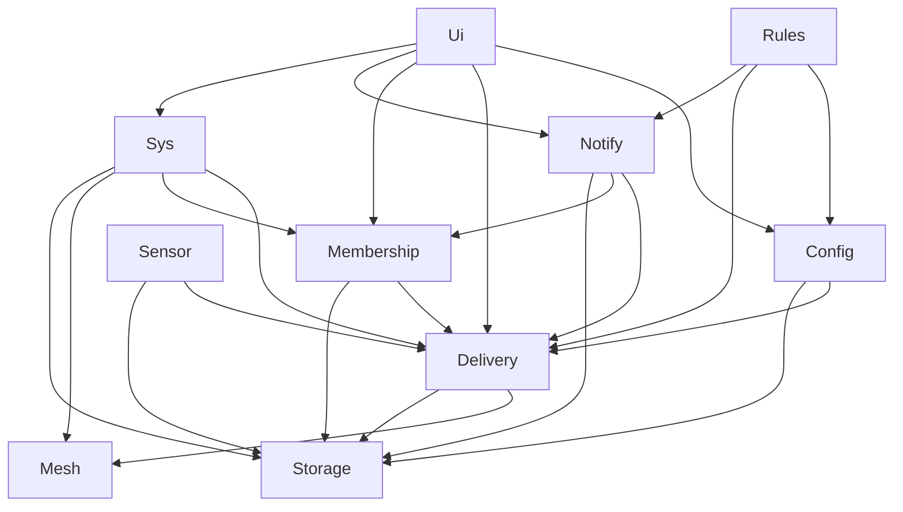
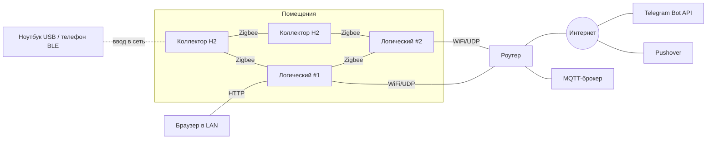

# Architecture Spine — garageAlarms 2.0

Приоритеты: **не потерять событие > не флудить > остальное.** Модель AP: доступность важнее согласованности, дубль допустим, потеря — нет.

## Design Paradigm

**Акторы поверх слоёного стека протоколов.** Каждый актор — задача FreeRTOS, единственный владелец своего состояния, общается только сообщениями через свою входную очередь.

| Актор | Слой | Владеет | Логический | Коллектор (H2) |
| --- | --- | --- | --- | --- |
| `Sensor` | драйверы | драйверы, каналы, сбор, антидребезг, кэш параметров своих каналов; выходы и их арбитраж, таблица локальных правил (коллектор) | ✔ | ✔ |
| `Mesh` | L1 | Zigbee-стек, UDP-транспорт, кадрирование, выбор канала | ✔ | ✔ (только Zigbee) |
| `Delivery` | L2 | ACK, повтор, антиповтор, дедуп, буфер неподтверждённых, репликация исходных событий | ✔ | ✔ |
| `Membership` | L3 | таблица живых узлов, heartbeat, вычисление лидера | ✔ | ✔ (без лидера) |
| `Config` | L4 | мягкий конфиг, правила, подписчики, режимы, версии, слияние | ✔ | — |
| `Rules` | L5 | исполнение правил, окна, производные события | ✔ | — |
| `Notify` | внешний | исходящая очередь, Telegram (отправка и `getUpdates`), Pushover, receipts, `offset`, MQTT-зеркало, его буфер и приём команд MQTT | ✔ | — |
| `Ui` | внешний | веб-интерфейс, разбор и исполнение команд | ✔ | — |
| `Sys` | сквозной | OTA, watchdog, время, самодиагностика, ввод в сеть | ✔ | ✔ |
| `Storage` | сервис | FRAM (логический) / NVS (коллектор) | ✔ | ✔ |



Стрелка = «может отправлять запрос». Обратное направление — только события по подписке (так `Notify` передаёт команды из `getUpdates` в `Ui`; `Delivery` — входящие события в `Rules` и `Notify`, глухоту узла в `Membership`, команды правил в `Sensor`; `Config` — параметры каналов в `Sensor`).

## Invariants & Rules

### AD-1 — Актор — единственный владелец своего состояния [ADOPTED]
- **Binds:** all
- **Prevents:** два модуля одновременно правят очередь/конфиг; гонки под мьютексами.
- **Rule:** Состояние актора недоступно другим ни по указателю, ни через глобальные переменные. Взаимодействие — только сообщения в очередь актора. Мьютекс допустим лишь внутри одного актора.

### AD-2 — Направление зависимостей
- **Binds:** all
- **Prevents:** циклы между слоями; нижний слой, знающий о правилах или Telegram.
- **Rule:** Запросы идут только по стрелкам диаграммы Paradigm. Вверх и между акторами одного уровня — только события по подписке. `Storage` ни от кого не зависит. Все события, включая события датчиков самого логического узла, проходят через `Delivery` — у `Rules` один вход.

### AD-3 — Никакого ожидания без границы
- **Binds:** all
- **Prevents:** зависание задачи → watchdog → перезагрузочная петля (урок 1.x).
- **Rule:** Каждое ожидание (сеть, шина, очередь, TLS) ограничено таймаутом «без прогресса». Блокирующий TLS — только в задаче `Notify`. Каждая задача зарегистрирована в task watchdog; зависшая задача перезагружает узел (panic), причину `Sys` пишет в журнал и передаёт в уведомление о неожиданной перезагрузке; отключать перезагрузку можно только в локальной стендовой сборке. TLS не начинается до синхронизации времени.

### AD-4 — `Storage` — единственный доступ к постоянной памяти; запись до подтверждения [ADOPTED]
- **Binds:** Storage, Sensor, Delivery, Notify, Config, Membership, Sys
- **Prevents:** два писателя FRAM или NVS; подтверждение того, что ещё не сохранено; фоновая запись задерживает ACK тревоги.
- **Rule:** К FRAM (логический) и NVS (коллектор; секреты логического узла) обращается только `Storage`; владелец секретов — `Sys`, `Ui` передаёт их запросом. Исключение — собственный раздел NVS стека Zigbee. ACK на событие и приём исходящего элемента — только после подтверждения записи от `Storage`. У `Storage` две входные очереди: тракт тревоги (журнал, `boot`, исходящая очередь) и фоновая (конфиг, MQTT, статистика, уплотнение, миграция); фоновая обслуживается кусками ≤ `GA_STORAGE_CHUNK` и только при пустой первой. FRAM — на своей шине, не общей с датчиками (SPI).

### AD-5 — `components/proto` — единственный источник протокола; подпись по сырым байтам [ADOPTED]
- **Binds:** все межузловые сообщения, обе прошивки
- **Prevents:** разное кодирование; узел N−1 ломает подпись сообщения узла N при перекодировании; пересылка после смены ключа отвергается.
- **Rule:** Конверт, ID, HMAC, типы, классы трафика и версии протокола определены только в `components/proto`, обе прошивки собирают его. Кадр = CBOR-массив `[body, kid, m]`: `body` — байтовая строка с CBOR-картой, `kid` — номер ключа сети, `m` — HMAC ключом `kid` над байтами `body`. При смене ключа узлы в течение `GA_KID_TRANSITION` принимают старый и новый `kid`, подписывают новым; автор, повторяющий своё неподтверждённое событие, переподписывает тот же `body` текущим ключом. Подпись проверяется до декодирования; пересылающий узел передаёт `body` байт в байт и никогда не перекодирует; тело со старым `kid` при пересылке вкладывается в конверт, подписанный текущим ключом. Типы выходов (AD-29): `output_cmd`, `output_state`, `output_intent`, `local_rules`. Карта `body`: `v` (версия), `t` (тип), `c` (класс трафика), `k` (критичность), `n` (EUI-64), `b` (boot), `q` (seq), `lw` (low-water надёжного потока), `ts`, `p` (нагрузка). Ключи короткие; незнакомые поля и типы пропускаются. Сообщение состояния канала укладывается в один Zigbee-кадр.

### AD-6 — Совместимость версий N и N−1
- **Binds:** proto, OTA, Rules
- **Prevents:** поэтапное OTA ломает сеть, где живут разные версии.
- **Rule:** Версия протокола N понимает N−1. Поля не удаляются и не меняют смысл внутри мажорной версии. Событие незнакомого типа подтверждается, хранится и реплицируется как непрозрачный `body`; маршрутизация и критичность берутся из полей `c` и `k`, а не из типа. Экземпляр правила с незнакомым шаблоном не исполняется и помечается в вебе.

### AD-7 — Идентичность [ADOPTED]
- **Binds:** proto, Membership, Config, Delivery, Rules, Sys
- **Prevents:** потеря настроек после перепрошивки; события после перезагрузки выброшены как дубли; разные ID одного производного события; сообщения без повтора или адресные сообщения блокируют антиповтор у других получателей.
- **Rule:** ID узла = EUI-64 Zigbee. ID события = `(node, boot, seq)`; `boot` — постоянный счётчик, увеличивается и записывается синхронно в `app_main` до создания задач акторов; `Delivery` не отправляет ни одного кадра до сообщения `boot_ready`. Потоки `seq`, каждый с 0 в каждой загрузке: широковещательный надёжный (события, `ack`, `delivered` — его номер и есть ID события), адресный надёжный — отдельный счётчик на пару `(src, dst)` (синхронизация конфига, параметры каналов коллектора, команды правил, `output_cmd`, `local_rules`), ненадёжный (heartbeat, снимки, ACK — свежесть по `(boot, ts)`, антиповтору AD-17 не подлежат). Производное событие: `(rule_id, window_start)`, где `window_start = floor(ts_источника / длина_окна) × длина_окна`. `channel_id` и `rule_id` присваивает `Config` при создании и не переиспользует. Мягкий конфиг привязан к EUI-64 и `channel_id`.

### AD-8 — Доставка «хотя бы один раз» [ADOPTED]
- **Binds:** Delivery, Notify, Sensor, Membership
- **Prevents:** потеря события; логические узлы считают правила по разным входам; один молчащий узел забивает буфер коллектора; критичное выпущено без подтверждения.
- **Rule:** Коллектор отправляет событие каждому логическому узлу, который `Membership` считает живым, и повторяет до ACK. Логические узлы дополнительно обмениваются исходными событиями между собой (сводка «`(node, boot)` → принятые `seq`» в пределах журнала того, у кого событие есть; запрос недостающих). Буфер неподтверждённых событий коллектора хранится в NVS через `Storage` с бюджетом записей `GA_COLLECTOR_NVS_BUDGET`; снимки состояния хранят только последнее значение канала. Любое событие покидает буфер только после ACK хотя бы одного логического узла. Некритичное — когда, кроме того, подтвердили все живые или прошёл `GA_ACK_ALL_TIMEOUT`. Критичное — когда подтвердили все живые неглухие логические узлы и не меньше двух, если неглухих два и больше. Пока версия параметров каналов не подтверждена логическим узлом (AD-14), коллектор хранит все свои фронты как критичные. Логический узел, живой по heartbeat, но не подтвердивший ни одного кадра за `GA_ACK_ALL_TIMEOUT` и не меньше `GA_DEAF_MIN_RETRIES` повторов, коллектор объявляет глухим (одно критичное событие здоровья на эпизод глухоты) и исключает из ожидаемых; первый ACK снимает глухоту. При переполнении вытесняются снимки, затем старейшие некритичные фронты; неподтверждённое критичное не вытесняется и не удаляется по числу попыток: сверх `GA_COLLECTOR_CRIT_PER_CHANNEL` критичные фронты одного канала сливаются в первый, последний и счётчик, место — `GA_COLLECTOR_CRIT_RESERVE`.

### AD-9 — Лидерство [ADOPTED]
- **Binds:** Membership, Notify, Ui
- **Prevents:** лидер без связи наружу; качание лидерства; узлы видят разные входы выбора.
- **Rule:** Каждый логический узел вычисляет лидера сам по данным heartbeat: среди логических узлов со здоровым uplink — минимальный `leader_priority`, затем минимальный EUI-64. Состояние uplink и `uplink_since` сообщает сам узел-источник в heartbeat; uplink бинарный с гистерезисом `GA_UPLINK_LOST` / `GA_UPLINK_RESTORED`. Лучший по приоритету узел возвращает лидерство только при `uplink_since` ≥ `GA_LEADER_RETURN`. Ручное назначение — запись `leader_override{node, until}` в мягком конфиге, действует сразу до `until` или отмены. Статусы: `LEADER` / `FOLLOWER` / `YIELDED` (AD-10) / `ISOLATED` (нет пиров и нет uplink: только копит). Узел без пиров, но с uplink — `LEADER`, но не раньше `GA_JOIN_GRACE` после старта: до этого срока или до первого heartbeat пира узел — `FOLLOWER`. Отдельно от лидера каждый узел тем же способом вычисляет роль «MQTT-узел»: среди логических узлов с `mqtt_up` (бинарный, гистерезис `GA_MQTT_UP_LOST` / `GA_MQTT_UP_RESTORED`, из heartbeat) — минимальный `leader_priority`, затем минимальный EUI-64; интернет для этой роли не нужен.

### AD-10 — Внешняя отправка и конфликт лидеров
- **Binds:** Notify, Ui, Membership
- **Prevents:** дубли от двух отправителей; повтор старых команд новым или заменённым лидером.
- **Rule:** В Telegram и Pushover отправляет и `getUpdates` (long polling) делает только `LEADER`; MQTT обслуживает MQTT-узел (AD-9, AD-24). `LEADER` держит в чате владельца закреплённое сообщение-аренду `lease{node, priority, until}` и продлевает его до истечения. 409 на `getUpdates` означает только «есть второй опрашивающий»: узел читает аренду через `getChat.pinned_message`; если она свежая и принадлежит другому узлу — `YIELDED` до её истечения; если просрочена — забирает её. Без доступной аренды — `YIELDED` на `GA_YIELD_BASE × (1 + ранг)`. В `YIELDED` нет `getUpdates` и некритичной отправки. `offset` (реплицируется как максимум) и множество выполненных `update_id` (объединение с обрезкой до старших `GA_TG_EXECUTED_IDS`) сохраняются и реплицируются **до** исполнения команды; исполнение — после подтверждения `offset` хотя бы одним живым пиром, без пиров — после записи в FRAM. Не исполняется команда с известным `update_id`, с `update_id` не больше минимального в множестве или с `date` старше `GA_CMD_MAX_AGE`. Узел без состояния `Notify` от пиров начинает с `offset = −1` и полученное последнее обновление не исполняет — только если за `GA_JOIN_GRACE` не услышан ни один пир, а аренда просрочена или отсутствует. Узел, ставший `LEADER`, принимает отправку всех недоставленных элементов.

### AD-11 — Страховка критичного [ADOPTED]
- **Binds:** Notify, Membership
- **Prevents:** тревога застряла у живого, но немого лидера.
- **Rule:** `FOLLOWER`, не увидевший `delivered` по всем единицам доставки критичного события за `GA_CRIT_FOLLOWER_T`, отправляет недоставленные единицы сам и публикует `delivered`. Mute никогда не глушит критичное.

### AD-12 — Выбор канала по классу трафика [ADOPTED]
- **Binds:** Mesh, Delivery, proto
- **Prevents:** объёмный трафик душит Zigbee-mesh; модули сами выбирают транспорт.
- **Rule:** Канал выбирает только `Mesh` по полю `c`: `sensor` — Zigbee; `critical` (тревоги, ACK, `delivered`, `ack`, heartbeat, `output_cmd`, `output_state`, `output_intent`) — Zigbee и UDP одновременно; `bulk` (синхронизация конфига и исходных событий, таблица `local_rules`, OTA логических узлов) — UDP, по Zigbee только при недоступности UDP и с ограничением скорости; OTA коллекторов по Zigbee — тоже `bulk`: ограничена по скорости и уступает кадрам `critical`. Zigbee-радио скрыто за интерфейсом `Mesh`: на логическом узле это H2 как RCP по UART, на коллекторе — нативный стек H2.

### AD-13 — Zigbee без координатора
- **Binds:** Mesh, Sys
- **Prevents:** Zigbee-координатор как скрытый хаб.
- **Rule:** Zigbee-сеть работает в режиме distributed security; все узлы от сети питания — роутеры. Параметры сети и ключ приходят при вводе в сеть (AD-17).

### AD-14 — Уровни конфигурации и владелец [ADOPTED]
- **Binds:** Config, Sensor, Rules, Ui, Notify, Membership
- **Prevents:** одна настройка с двумя владельцами; воскрешение удалённого при слиянии; расхождение критичности; молчаливая потеря правок вернувшегося узла.
- **Rule:** H (прошивка): манифест датчиков, драйверы, шаблоны правил. S (мягкий): имена, зоны, назначение и `criticality` каналов, интервалы, пороги, экземпляры и наборы правил (`severity`), режимы, граф зон, `leader_priority`, `leader_override`, подписчики и владелец, окно mute, маршрутизация уведомлений. Параметры выходов (`max_on`, безопасное состояние, `mqtt_control`, `bot_control`) — тоже S. R (рантайм): значения, здоровье. Писатель S — только `Config`; версия на ключ, слияние LWW по HLC `(wall_ms, counter, EUI-64)`; удаление — надгробие, не стирание. Синхронизация передаёт записи в порядке HLC; узел объявляет в heartbeat водяной знак `W` («есть все записи с HLC ≤ `W`»). Надгробие удаляется, когда старше `GA_TOMBSTONE_TTL` и `W` каждого живого логического узла не меньше его HLC. Отсутствие узла измеряют соседи: узел, отсутствовавший дольше `GA_TOMBSTONE_TTL`, забирает конфиг у соседа с наибольшим `W`, работавшего всё это время, а свои расхождения показывает в вебе как конфликты; если такого соседа нет (отсутствовали все), узлы сливают конфиги обычным образом. Конфликт одновременных правок одного ключа показывается в вебе. Критичность события ставит узел-источник в поле `k` по своей копии конфига. Коллектор получает параметры своих каналов надёжным сообщением с версией, хранит копию через `Storage` и сообщает её версию в heartbeat (так же — таблицу локальных правил, AD-16); пока версия расходится, логический узел, первым принявший событие, может повысить его критичность по своему конфигу, понизить — нет; повышение реплицируется вместе с событием как «`k` не ниже X», и все узлы берут максимум.

### AD-15 — Каналы и датчики [ADOPTED]
- **Binds:** Sensor, proto, Rules
- **Prevents:** правила, завязанные на конкретный датчик; ручная привязка пинов из веба; пересечение порога теряется в слитых снимках.
- **Rule:** Единица модели — канал: `binary | numeric | counter | enum | output` (выход — AD-29), единица, диапазон, `health: ok|fault|open|short|stale`. Привязка к железу — только манифест прошивки. Драйверы датчиков — плагины с общим интерфейсом (шина, возможные адреса, `probe`, список каналов, чтение, опрос) в реестре, заполняемом при компиляции; новый датчик = файл драйвера + перекомпиляция, ядро не меняется. Автообнаружение перебирает только скомпилированные драйверы (1-Wire по ROM ID; I²C по адресу + `probe` с чтением ID/поведения); при совпадении адресов у разных драйверов решает `probe`, неоднозначное не регистрируется. I²C — только внутри корпуса; выносные — 1-Wire. Сбор: антидребезг по времени с cooldown; прогрев только для PIR. Узел публикует описание каналов (по смене версии) и состояние (по изменению и периодически). Пересечение порога, заданного каналу в мягком конфиге, источник выдаёт как фронт (хранится до ACK), а не как снимок; правило на числовом канале опирается только на пороги, переданные источнику.

### AD-16 — Правила считают логические узлы, все; коллектор — только локальные [ADOPTED]
- **Binds:** Rules, Sensor, Delivery, Notify
- **Prevents:** правило срабатывает на одном логическом узле и не на другом; коллектор с логикой; опоздавшая тревога теряется или считается по-разному.
- **Rule:** Коллектор исполняет только локальные правила: правило одного события своего канала с действием на свой выход (AD-29), без окна и `when`; `Config` помечает такое правило при сохранении и передаёт коллектору таблицу локальных правил адресным надёжным сообщением с версией (≤ `GA_LOCAL_RULES_MAX`), коллектор хранит её через `Storage` и сообщает версию в heartbeat; команда локального правила несёт тот же `cmd_id`, что у логических узлов, и тот же `ts`, если коллектор знает время (иначе — AD-29); применяется один раз по `cmd_id`. Все экземпляры правил исполняются на каждом логическом узле детерминированно из одного и того же множества исходных событий (AD-8) по `ts` источника. Окно любого правила ≤ `GA_RULE_WINDOW_MAX`, проверяется при сохранении. Состояние окон производное: после перезагрузки восстанавливается проходом журнала от `ts` курсора `Rules` минус `GA_RULE_WINDOW_MAX` (AD-28), эффекты при этом выдаются всегда, а `Notify` отсеивает их по `event_id`. Горизонт опоздания: событие с `ts` < `now − GA_RULE_WINDOW_MAX` обрабатывают только правила одного события (с пометкой «с опозданием»), оконные правила его не учитывают. Базовая тревога критичного канала — всегда правило одного события; горизонт на неё не действует. Правило = шаблон + экземпляр + необязательное `when` (и/или/не, сравнения, режим, время, состояние; без циклов и переменных), проверяемое при сохранении. Команды правил (опросить, burst-интервал) — адресные надёжные сообщения через `Delivery`, у получателя доходят до `Sensor` событием по подписке; несут ID и TTL и откатываются сами. Опоздавшее за горизонт событие эпизоды (AD-21) не меняет и даёт отдельную тревогу «с опозданием».

### AD-17 — Безопасность сети и ввод узла [ADOPTED]
- **Binds:** proto, Delivery, Mesh, Storage, Sys
- **Prevents:** подделка/повтор сообщений; кража токенов с флеша; чужая прошивка; окно антиповтора, вставшее на дыре; `lw`, скрывший событие, которое никто не получил.
- **Rule:** Каждый кадр подписан HMAC ключом сети (AD-5). Антиповтор надёжного потока (AD-7): окно принятых `seq` размером `GA_SEQ_WINDOW` на поток; база окна = max(непрерывный префикс принятых, `lw` этого потока из кадра), никогда не уменьшается; кадр за пределами окна не подтверждается (отправитель повторит); непринятое никогда не считается дублем; повтор уже принятого события получает ACK заново и дальше не передаётся. Отправитель поднимает `lw` только за номерами, которые он больше никогда не повторит и содержимое которых учтено: широковещательное событие подтвердил хотя бы один логический узел; некритичное вытеснено; фронт поглощён слиянием (сводная запись получает новый `seq` и несёт диапазон поглощённых номеров, включая прежний номер перевыпущенной сводной записи); адресное сообщение подтвердил его получатель, у него истёк TTL или оно заменено новой версией. `lw` не перекрывает неподтверждённое критичное, содержимое которого не перенесено в другую запись буфера; сводная запись сама требует ACK; `lw` ограничивает только окно антиповтора, не обмен недостающими между логическими узлами. Получатель хранит окна последних `GA_DEDUP_BOOTS` загрузок узла; кадр старой загрузки принимается, если её окно хранится или `seq` ≥ её `lw` из последнего heartbeat отправителя. Секреты — только в зашифрованном NVS. Логические узлы в серийном исполнении — secure boot v2 (RSA-3072) + flash encryption. OTA-образ принимается только с валидной подписью. Ввод: USB (раздел секретов), для логического узла — собственная WiFi-точка (SoftAP), для коллектора — BLE (Security 2, веб-страница через Web Bluetooth); окно ограничено и открыто только пока Zigbee-стек не запущен; все способы пишут одну запись provisioning в один namespace.

### AD-18 — OTA по одному узлу с откатом
- **Binds:** Sys, Mesh
- **Prevents:** одновременное обновление кладёт сеть; прошивка-кирпич.
- **Rule:** Одновременно обновляется не больше одного узла. Логические — по UDP (образ загружают через веб), вместе с RCP-прошивкой своего H2. Коллекторы — по Zigbee OTA Upgrade cluster, сервер — `LEADER`. Новая прошивка подтверждает себя только после входа в сеть, иначе откат.

### AD-19 — Живость и самодиагностика
- **Binds:** Membership, Sensor, Rules, Delivery
- **Prevents:** мёртвый узел или датчик выглядит как «тихо»; коллектор не знает, кому слать.
- **Rule:** Heartbeat несёт роль, статус, uplink и `uplink_since`, `leader_priority`, водяной знак конфига `W` (AD-14), версию параметров каналов (коллектор), `lw` по незакрытым загрузкам (AD-17), `GA_CONFIG_VERSION` (AD-25), флаги наличия внешних секретов, `mqtt_up` (логический), версию таблицы локальных правил (коллектор), здоровье каналов и время отправителя. Коллектор узнаёт список логических узлов только из heartbeat. Пропавший узел, канал в `stale`/`open`/`short` — событие шаблона «здоровье»; для критичного канала — критичное. Ежедневный heartbeat-отчёт владельцу делает молчание значимым.

### AD-20 — Время
- **Binds:** Sys, Rules, Config, Sensor
- **Prevents:** окна считаются по несогласованным часам.
- **Rule:** Логические узлы синхронизируются по NTP; без NTP источник времени — `LEADER`. Коллектор берёт время из heartbeat логических узлов. `ts` события ставит узел-источник. Слияние конфига — по HLC, не по голым часам.

### AD-21 — Единица доставки, подтверждение человеком, эпизод тревоги
- **Binds:** Notify, Delivery, Config, Rules
- **Prevents:** `delivered` для одного чата гасит отправку остальным; подтверждение в одном канале не останавливает повторы в другом; обрыв интернета останавливает приём событий; повторные срабатывания одного канала флудят; эпизод глотает новое вторжение или считается на узлах по-разному.
- **Rule:** Единица доставки — `(event_id, recipient, channel)`. `delivered` публикует тот узел, который отправил, по каждой единице, вместе с `message_id`; исходящий элемент удаляется, когда все единицы доставлены или окончательно отклонены. Исходящая очередь всегда принимает элемент: при переполнении вытесняется старейший некритичный со сводкой «пропущено N»; критичным отведена квота `GA_OUTBOX_CRIT_QUOTA`, сверх неё критичные элементы одного канала сливаются в один с «+N». `Notify` идемпотентен по `event_id` в пределах `GA_RULE_WINDOW_MAX` + `GA_NOTIFY_IDEMP_MARGIN`. Pushover получает только критичные события, `priority=2`, `tag = event_id`; лишние копии отменяются `cancel_by_tag`. Подтверждение человеком в любом канале — реплицируемое событие `ack{event_id, by}`, оно гасит повторы, напоминания и Pushover во всех каналах. Эпизод тревоги канала вычисляет `Rules` только по `ts` источника; ключ — `(channel_id, ts первого срабатывания)`; открытие эпизода публикуется производным событием через `Delivery`, ключ после публикации не меняется; из пересекающихся открытий одного канала все узлы оставляют открытие с минимальным `ts`, остальные сливаются в него: выжившее наследует их единицы доставки, `message_id` и `ack`, их `event_id` для `Notify` — синонимы выжившего; если хоть одно слитое открытие уже доставлено, выжившее даёт только правку сообщения, без Pushover и без страховки AD-11. `GA_EPISODE_MAX` ≤ `GA_RULE_WINDOW_MAX`, поэтому открытый эпизод всегда восстанавливается из журнала после перезагрузки. Норма — неактивное значение при `health = ok`. Эпизод закрыт, если после возврата в норму нет срабатывания с `ts` в течение `GA_ALARM_REARM`; решение принимается не раньше `GA_ALARM_REARM` + `GA_EPISODE_GRACE` после нормы. Повторное срабатывание в открытом эпизоде правит сообщение тревоги («повторных срабатываний: N»); если правка невозможна — новое сообщение без Pushover. Новая тревога (с Pushover для критичного): срабатывание после закрытия эпизода, позже `ack` + `GA_ALARM_REARM` или позже начала эпизода + `GA_EPISODE_MAX`. Если первое срабатывание некритичного эпизода пришлось на mute, первое срабатывание после окончания mute отправляется как тревога.

### AD-22 — Внешние каналы и права
- **Binds:** Notify, Ui, Config
- **Prevents:** новый лидер не знает, кому слать; изменение критичного правила из Telegram.
- **Rule:** Подписчики, владелец и окно mute — в мягком конфиге. Подписка — по PIN; владельца отписать нельзя; команды принимаются только от подписанных чатов, опасные (перезагрузка, лидер) — только от владельца и с подтверждением. Telegram умеет: статус (с лидером и узлами), отчёты, тест, подтверждение, mute некритичного, `/leader`, ручное управление выходами с флагом `bot_control` — только владелец и операторы (AD-29). Правила и конфиг — только локальный веб; критичное правило выключается только там и только временно (≤ `GA_CRIT_DISABLE_MAX`), с событием всем подписчикам. Каждое сообщение подписано узлом-отправителем и его статусом. Уведомления о перезагрузке — только владельцу, с причиной сброса и ограничением частоты. Между отправками в Telegram выдерживается пауза.

### AD-23 — Эксплуатация и секреты
- **Binds:** Sys, Config, Ui, Storage
- **Prevents:** токен бота гуляет по сети; нельзя заменить узел; конфиг теряется с последним узлом.
- **Rule:** Внешние секреты (токен Telegram, ключи Pushover, логин MQTT, логин и пароль веба) не передаются между узлами — каждый логический узел получает их при вводе или в своём веб-интерфейсе, который работает только по HTTPS; сертификаты узлов подписывает собственный CA системы, корневой сертификат ставится на телефоны. Пакет ключей для нового узла шифруется кодом с его наклейки, одноразовый, действует `GA_KEYPACK_TTL`. Ключи dev и prod разные. Веб умеет экспорт и импорт мягкого конфига (файл) и «забыть узел». Существование узла — ключ мягкого конфига `node/<eui>` с номером воплощения; `Membership` выводит своё состояние из него; «забыть» — надгробие этого ключа; повторный ввод того же модуля создаёт новое воплощение, ключи прежнего воплощения не сливаются. Замена секрета — повторный ввод узла.

### AD-24 — MQTT: зеркало с отдельным буфером и команды выходов
- **Binds:** Notify, Storage, Config, Ui, Membership
- **Prevents:** недоступный брокер вытесняет тревоги из основной очереди; команда из MQTT действует на то, что не разрешено; старая или retained-команда срабатывает после переподключения; принятая команда теряется при отказе MQTT-узла.
- **Rule:** Публикует MQTT-узел (AD-9), JSON с `event_id`, QoS 1. Темы: `<prefix>/<node>/<channel>/state` (retained), `<prefix>/events`, `<prefix>/<node>/health`, `<prefix>/<node>/<channel>/result`. Команды принимаются только для выходов с флагом `mqtt_control` на `<prefix>/<node>/<channel>/set` (JSON `{value, until?, ts?}`); на другие темы подписок нет. Команды принимаются только по MQTT 5: все логические узлы с логином MQTT подписаны на `set` постоянной сессией (`clean_start = false`, session expiry `GA_MQTT_SESSION_EXPIRY` ≥ `GA_CMD_MAX_AGE`), поэтому брокер держит команду, пока подписчик переподключается; урезанный брокером срок или брокер без MQTT 5 — событие здоровья, и на этом узле `mqtt_control` недоступен. Retained-сообщения на темах команд и команды с `ts` из JSON старше `GA_CMD_MAX_AGE` отбрасываются; `ts` из JSON только проверяет возраст. MQTT-узел создаёт `output_intent` (AD-29) и отправляет PUBACK брокеру только после записи намерения в FRAM. Намерение из MQTT несёт отпечаток сообщения (хеш темы и payload). Ведомый страхует каждое полученное сообщение: если за `GA_MQTT_INSURE_T` после его приёма не стало известно ни одного намерения `manual` этого выхода, создаёт его сам с `ts` = HLC времени своего приёма; не создаёт, если намерение с этим отпечатком уже есть. Результат — в `state`, отказ с причиной — в `result`. Буфер MQTT — отдельная ограниченная область FRAM через `Storage`, не общая с исходящей очередью; при переполнении вытесняется его старейший элемент. MQTT не входит в единицы доставки AD-21 и не задерживает удаление исходящего элемента. Адрес, порт, TLS, префикс, «включено» — мягкий конфиг; логин и пароль — секрет узла (AD-23), вводится в локальном вебе каждого логического узла.

### AD-25 — Единый файл констант
- **Binds:** all
- **Prevents:** одна и та же величина (период heartbeat, порог `stale`, T) задана по-разному в прошивке коллектора и логического узла; «магические числа» по коду.
- **Rule:** Все таймауты, интервалы, размеры буферов и прочие настраиваемые константы — только в `components/ga_config/include/ga_config.h`, который собирают обе прошивки; литералы таких значений в остальном коде запрещены. У файла есть номер версии `GA_CONFIG_VERSION`, он передаётся в heartbeat; расхождение у узлов — событие «здоровье». Константа, которую может переопределить мягкий конфиг, помечена в заголовке как значение по умолчанию.

### AD-26 — Размещение задач по ядрам и приоритеты [ADOPTED]
- **Binds:** все акторы, `Sys`, сборка `logic-s3` и `collector-h2`
- **Prevents:** TLS-рукопожатие, веб или запись во флеш задерживают приём и подтверждение тревоги; каждый модуль сам выбирает ядро и приоритет.
- **Rule:** На S3 ядро 0 — внешний мир: WiFi, lwIP (закреплён явно), `Notify`, `Ui`, `Sys`; ядро 1 — тракт тревоги: `Mesh` (задача стека Zigbee с UART к RCP и задача актора, UDP), `Delivery`, `Storage`, `Membership`, `Sensor`, `Rules`, `Config`. Приоритеты ниже системных задач WiFi/lwIP, по убыванию: `Mesh` > `Delivery` > `Storage` > `Membership` = `Sensor` > `Rules` > `Config` > `Notify` > `Ui` > `Sys`; на коллекторе: `Mesh` > `Delivery` > `Storage` > `Membership` = `Sensor` > `Sys`. Ядро, приоритет и стек каждой задачи — константы `ga_config.h`; привязка делается только в оболочке актора (AD-27). Стеки задач и код, работающий во время записи во флеш, — во внутренней RAM, обработчик UART RCP — в IRAM; запись во флеш (OTA, NVS) идёт порциями ≤ `GA_FLASH_OP_MAX_MS`; крупные буферы (TLS, HTTP) — в PSRAM.

### AD-27 — Чистое ядро и тонкая оболочка актора; уровни тестов [ADOPTED]
- **Binds:** все компоненты-акторы, `proto`, тесты
- **Prevents:** логика, проверяемая только на железе; код RTOS и логика вперемешку; таймауты, которые срабатывают только при следующем сообщении; распределённые сбои, которые находятся только на стенде.
- **Rule:** Компонент актора делится на `core/` (детерминированная машина состояний `step(state, msg, now, rng) → effects`: без FreeRTOS и ESP-IDF, без чтения часов, без блокировок, без неограниченного `malloc`; время и случайность приходят аргументами; `ga_config.h` и `proto` (с TinyCBOR) допустимы и собираются без IDF, криптография — через порт), `port/` (интерфейсы внешних зависимостей) и `shell/` (задача FreeRTOS: очередь → `step` → исполнение эффектов через порты). Эффекты содержат ближайший срок `next_deadline`; оболочка вызывает `step` с `tick` не позже него. `esp_err_t` — только в `shell/` и `port/`. Исключение — `Mesh`: стек Zigbee крутит свой блокирующий цикл в отдельной задаче и передаёт события в очередь актора. Ядра собираются отдельной целью без заголовков IDF и FreeRTOS. Уровни тестов: (1) юнит-тесты ядер на компьютере, покрытие строк и ветвей ≥ 90 %; (2) детерминированный симулятор сети без FreeRTOS — N логических узлов и коллекторов с настоящими ядрами, потери, задержки, разрывы, обрыв питания между любыми двумя записями `Storage`, OTA с откатом, воспроизводимые по seed; обязательные инварианты: подтверждённое событие не потеряно, опоздавшее критичное доставлено, ≤ 1 дубля на единицу доставки при смене лидера, содержимое критичного не покидает буфер коллектора без ACK, событие, выпущенное коллектором, за ограниченное время есть у каждого живого логического узла, адресная синхронизация с медленным пиром не останавливает приём у третьего узла, ключи эпизодов совпадают у всех узлов при любом порядке прихода, срабатывание после `ack` + `GA_ALARM_REARM` даёт новую тревогу, старт нового узла не теряет обновлений Telegram, лидеры сходятся к одному, потеря кадра без повтора не останавливает приём, обрыв uplink не снижает приём событий датчиков, перезагрузка не повторяет уже доставленные уведомления, повторные срабатывания в эпизоде не создают новых тревог, таймауты срабатывают не позже `next_deadline + GA_TICK_JITTER`, итоговое состояние выхода не зависит от порядка и дублей команд, `manual` не перебивает `protect`, `max_on` срабатывает без сети, локальное правило срабатывает при выключенных логических узлах, команда MQTT, на которую подписчик отправил PUBACK брокеру, доходит при отказе MQTT-узла, команды с расходящимися часами узлов и проход журнала после перезагрузки не возвращают старое значение; (3) тесты адаптеров (порты) на плате; (4) стендовые испытания.

### AD-28 — Персистентность FRAM [ADOPTED]
- **Binds:** `Storage`, владельцы регионов (`Delivery`, `Notify`, `Config`, `Membership`, `Sys`), `Rules`
- **Prevents:** подтверждение недописанной записи после обрыва питания; принятое, но не сохранённое событие; два актора в одном регионе; потеря журнала при OTA, откате или смене чипа; вытеснение ещё не обработанного.
- **Rule:** Файловой системы нет. FRAM размечена на регионы по таблице в суперблоке (две копии A/B: magic, версия разметки, регионы, CRC); у каждого региона один актор-владелец, доступ только через `Storage`. Видов региона два: журнал (кольцо, только добавление, указатели головы и хвоста) и слот A/B (запись в неактивную копию с порядковым номером и CRC); правка на месте запрещена — конфиг и исходящая очередь хранятся журналами с уплотнением, место под уплотнение входит в регион. Порядок записи: тело с CRC → сдвиг указателя головы (две копии с номером и CRC) → подтверждение `Storage`. Указатель хвоста фиксируется до повторного использования места. При восстановлении отбрасывается только недописанное после зафиксированной головы; битая запись внутри зафиксированного диапазона пропускается с событием здоровья. Состояние в двух регионах пишется в порядке «факт → производное» и восстанавливается из факта: точка фиксации входящего события — запись журнала, окно дедупа выводится из журнала. Курсор «обработано» каждого потребителя журнала (`Rules` — события, `Notify` — `ack`/`delivered`/производные, `Config` — записи синхронизации конфига) хранит `Delivery`; потребитель сдвигает курсор после подтверждения всех своих эффектов; журнал не вытесняет дальше минимального курсора и вытесняет сначала обработанное старше окна, затем обработанное в окне (событие здоровья «история правил неполна»), необработанное — никогда. Заголовки регионов и записей бинарные с версией, содержимое — CBOR; тело входящего события хранится байт в байт как пришло, с подписью. Разметку определяет только суперблок; константы `ga_config.h` и RDID используются при первом форматировании; RDID сверяется с таблицей известных микросхем, неизвестный ID — отказ. Миграция только добавляет регионы или растит их в резерв, не сдвигая существующие, и выполняется после самоподтверждения новой прошивки (AD-18); прошивка N читает разметку N+1. Форматирование непустого журнала — только явной командой из веба.

### AD-29 — Выходы и команды выходов
- **Binds:** Sensor, Rules, Delivery, Notify, Ui, Config, Storage, Membership, proto
- **Prevents:** реле застряло включённым; два отправителя или расходящиеся часы переключают реле в разном порядке; ручная команда отменяет защиту; старая команда снова срабатывает после перезагрузки; защита снята перезагрузкой коллектора; реле не работает без интернета или лидера; команда теряется при отказе узла.
- **Rule:**
  - **Выход.** Канал `output` подтипа `switch | buzzer`, только на коллекторе; пин и необязательный вход подтверждения — в манифесте. Команда выхода не отправляется коллектору, в описании каналов которого нет этого выхода (узел N−1, AD-6).
  - **Команда.** `output_cmd{cmd_id, channel_id, level, value: on|off|release|pulse, ts, until}` — адресное надёжное сообщение класса `critical`; повторяется до ACK, заменяется только командой того же выхода и уровня с бо́льшим `ts`; TTL = `until`, без `until` — без TTL. `ts` команды — HLC `(wall_ms, counter, EUI-64)` (AD-14): у команды правила — (`ts` причины, 0, EUI-64 источника причины), у `release` по `ack` — (max(`ts` подтверждения, `ts` включившей команды) + 1 мс, 0, EUI-64 узла подтверждения), у намерения — HLC принявшего узла; порядок команд в слоте — по паре (`ts`, `cmd_id`), «новее» — строго больше пары.
  - **Арбитраж на узле выхода — единственном владельце состояния.** Слоты `protect > manual > auto`; команда, включая `release`, занимает слот, только если она новее слота; очищенный, истёкший (`until`) или отсечённый (`max_on`) слот хранит пару последней команды, команда не новее её отклоняется с причиной `stale`. `stale` с тем же значением, что действует, — не отказ; отказ `stale` сообщается только источнику ручной команды (ответ бота или веба, `result` MQTT), отклонения команд правил пишутся в журнал без уведомления. Действует старший слот со значением, без них выход выключен. Дедуп по паре (`cmd_id`, `level`): тот же `cmd_id` с более высоким уровнем — повышение, оно очищает нижний слот с сохранением его пары. Слот `protect` с парой и остатком `max_on`/`until` пишется через `Storage` в NVS до ACK, из резерва `GA_OUTPUT_NVS_RESERVE` вне бюджета событий — по одной записи на выход, выходов на коллекторе не больше резерва (проверка при сборке манифеста); `manual` и `auto` — в RAM. После перезагрузки отсчёт `max_on`/`until` продолжается с остатка; `GA_OUTPUT_BOOT_LOOP` перезагрузок подряд во включённом состоянии дают безопасное состояние и `fault`. Логический узел, увидевший новый `boot` коллектора в heartbeat, шлёт ему последнюю известную команду каждого слота каждого выхода, включая `release` и `off`, с её парой; до первого heartbeat после загрузки коллектор держит `manual` и `auto` в безопасном состоянии.
  - **Источники.** Команды шлёт каждый логический узел сам, без лидера. Команда правила: причина — исходное событие, у оконного правила — производное событие AD-7; `cmd_id = rule_id@event_id` причины, `ts` = `ts` причины (у производного — `window_start`); уровень `protect`, если итоговое `k` причины критично, иначе `auto`. `Rules` не выдаёт команд выходов при проходе журнала до своего курсора; включающие команды (`on`, `pulse`) не выдаются и для причины с `ts` < `now − GA_CMD_MAX_AGE`, а `release` и `off` выдаются всегда — лишний отсеет сравнение пар. `release` правила адресуется всем слотам, занятым командами этого правила; Последнюю известную команду каждого слота логический узел выводит из журнала (намерения и срабатывания правил), отдельно не хранит; новый `boot` коллектора видит по полю `b` его heartbeat. У правил тревоги действие выхода срабатывает на открытие эпизода AD-21, а не на каждое срабатывание. Режим действия задаётся в правиле: «пока активно» (`release` при возврате в норму), «до подтверждения» (`release` по `ack` эпизода), «импульс» (`pulse`). Ручная команда (веб, бот, MQTT): принявший узел создаёт реплицируемое событие `output_intent` класса `critical` (уровень `manual`, `ts` — HLC не меньше последнего известного узлу `output_intent`/`output_state` этого выхода, `cmd_id` = его `event_id`), шлёт команду сразу после записи в FRAM, остальные логические узлы — по приходу события.
  - **Безопасность на узле выхода.** `max_on` (мягкий, ≤ `GA_OUTPUT_MAX_ON_MAX`) и `GA_BUZZER_MAX` отсчитываются от перехода выхода в `on` и командами не перезапускаются; для `protect` у `switch` `max_on` задаётся отдельно и может быть снят. `until`, `max_on` и пределы считаются по монотонным часам узла. Безопасное состояние при старте и после `GA_OUTPUT_LINK_LOST` без heartbeat логических узлов — `off | hold` и действует только на слоты `manual` и `auto`; `on` запрещён; `hold` хранится в NVS. `ts` локального правила — время последнего heartbeat плюс монотонное время; без heartbeat с загрузки — максимальная пара слотов из NVS со счётчиком + 1 и флагом «время неизвестно», так что сохранённый слот не блокирует локальное правило. Подтверждение, не совпавшее с командой за `GA_OUTPUT_FEEDBACK_TIMEOUT`, переводит канал в `health = fault`.
  - **Состояние.** `output_state{value, level, cmd_id, ts, feedback}` (`ts` — пара действующего слота) — снимок (последнее значение, AD-8) по смене действующего слота или уровня, не по такту паттерна зуммера; фронтами (хранятся до ACK) идут только отказы и `fault`.

## Consistency Conventions

| Concern | Convention |
| --- | --- |
| Язык | Код, комментарии, логи — английский; тексты пользователю — русский, только в модуле сообщений `Notify`/`Ui` |
| Имена | Акторы — `PascalCase`; компоненты ESP-IDF — `snake_case`; коды типов, классов и полей — только константы из `proto` |
| ID | Узел — EUI-64 (16 hex); событие — `node:boot:seq`; производное — `rule_id@window_start` |
| Время | UTC epoch в сообщениях; локальное время только при выводе; сообщение, пролежавшее в очереди, помечается «с опозданием» |
| Сообщения акторов | Одна входная очередь на актор; запрос ↔ ответ по `corr_id`; события — через подписку |
| Ошибки | `esp_err_t` на границе `shell/` и `port/` (AD-27); сетевые ошибки — повтор с экспоненциальной паузой, не abort |
| Логи | `ESP_LOG*` с тегом актора; кадры печатаются через `cborjson` |

## Stack

| Name | Version |
| --- | --- |
| ESP-IDF | v6.0.x (последний патч ветки 6.0; v6.1 — после подтверждения esp-zigbee-lib) |
| esp-zigbee-lib | 2.0.4 |
| espressif/cbor (TinyCBOR) | 7.0.0 |
| espressif/network_provisioning (логический узел) | 1.2.5 |
| protocomm из ESP-IDF (коллектор, BLE) | в составе ESP-IDF |
| Логический узел | ESP32-S3 (модуль с PSRAM) + ESP32-H2 как Zigbee RCP (UART), раздельные антенны |
| Коллектор | ESP32-H2 |
| FRAM | SPI с командой RDID, ≥ 256 КБ: MB85RS4MT 512 КБ (Adafruit 4719, RDID `04 7F 49 03`) — основная; MB85RS2MTA, Infineon FM25V20A — допустимые |
| espressif/mqtt | 1.0.0 |
| Внешние API | Telegram Bot API; Pushover Messages + Receipts API; MQTT 3.1.1 / 5 (брокер пользователя; команды выходов — только MQTT 5) |

## Structural Seed



```text
garageAlarms2.0/
  components/
    ga_config/    # все константы и таймауты (AD-25)
    proto/        # кадр, конверт, ID, HMAC, типы, классы, версии (AD-5)
    mesh/ delivery/ membership/ storage/ sensors/ sys/
    config/ rules/ notify/ ui/     # только логический узел
    # компонент актора: core/ (чистая логика), port/ (интерфейсы), shell/ (задача FreeRTOS), test/ (AD-27)
  test/host/      # тесты ядер и симулятор сети на Linux-таргете ESP-IDF
  apps/
    logic-s3/     # сборка логического узла (хост; H2 — готовая RCP-прошивка Espressif)
    collector-h2/ # сборка коллектора
```

Текущий репозиторий `garageAlarms` (Arduino, ESP32-S3) не переносится и остаётся рабочим до ввода новой сети.

Регионы FRAM — стартовая разметка на 256 КБ (AD-28; размеры — в `ga_config.h`); остаток более ёмкой микросхемы — резерв под миграцию:

| Регион | Владелец | Старт |
| --- | --- | --- |
| Суперблок A/B | `Storage` | 2 × 256 Б |
| Состояние узла (`boot`, время уведомлений о перезагрузке) | `Sys` | 256 Б |
| Журнал входящих = история событий | `Delivery` | 96 КБ |
| Дедупликация `(node, boot)` → окно `seq` | `Delivery` | 3 КБ |
| Исходящая очередь и единицы доставки | `Notify` | 32 КБ |
| Состояние `Notify` (`offset`, `update_id`, receipts, индекс `ack`/`delivered`/`message_id`) | `Notify` | 8 КБ |
| Мягкий конфиг | `Config` | 48 КБ |
| Буфер MQTT | `Notify` | 24 КБ |
| Статистика 7 дней | `Membership` | 4 КБ |
| Резерв под миграцию | — | остаток |

## Open Questions

| # | Вопрос | Блокирует |
| --- | --- | --- |
| Q3 | Смена ключа Zigbee-сети без Trust Center — решено: повторный ввод всех узлов (вне MVP); ключ HMAC меняется через `kid` (AD-5) | — |
| Q5 | Компактное кодирование `cmd_id` (`rule_id@event_id`) и HLC, чтобы `output_cmd` с подписью уложился в `GA_ZB_FRAME_MAX_BYTES` | история 1.2 |
| Q4 | OTA-сервер на роутере в distributed-сети — проверить на прототипе; запасной путь — своя передача образа через L2 (`bulk`) | эпик OTA коллекторов |

## Deferred

| Что | Почему может подождать |
| --- | --- |
| Грамматика `when` и устройство движка правил | Ограничено AD-16; эпик правил |
| Технология веб-интерфейса, формат его API, аутентификация | Внутри `Ui`, только LAN |
| Значения T, N, M, `base`, интервалы heartbeat и обмена исходными событиями | Настройки, подбираются на прототипе; форма зафиксирована в AD |
| Окончательный набор драйверов, RS-485 | Расширяется манифестом |
| Второй канал LTE/SMS | Ещё один канал в единице доставки AD-21 |
| Модуль, платы, питание и резерв | Закупка |
| Планирование Zigbee-канала/PAN, диапазон WiFi | По месту установки |
| Удалённая диагностика и журнал событий | После MVP |
| Выходы на логическом узле; автообнаружение Home Assistant | Выходы только на коллекторах (AD-29); MQTT-темы уже позволяют ручную интеграцию |
| Формат паттерна зуммера и JSON команд MQTT по полям | Эпик 10; форма зафиксирована в AD-24, AD-29 |
