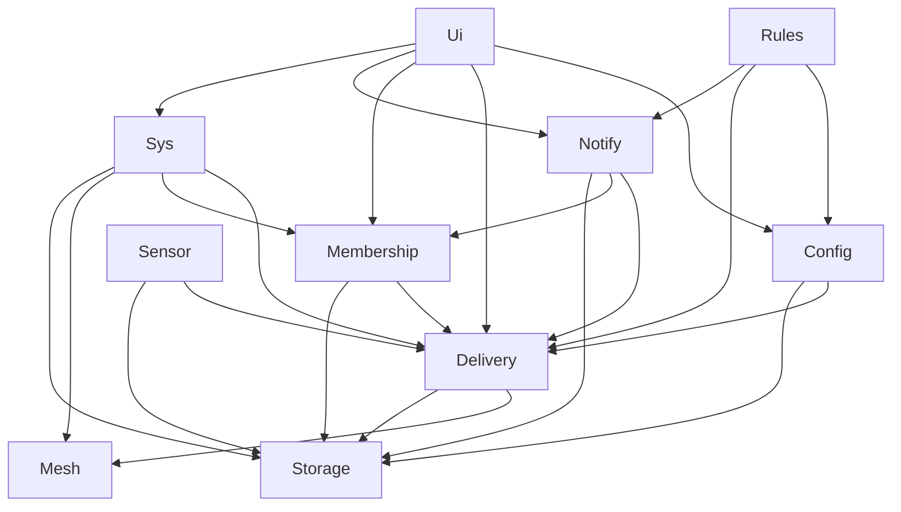
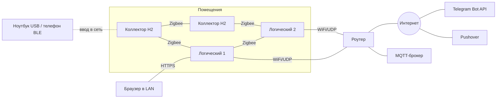
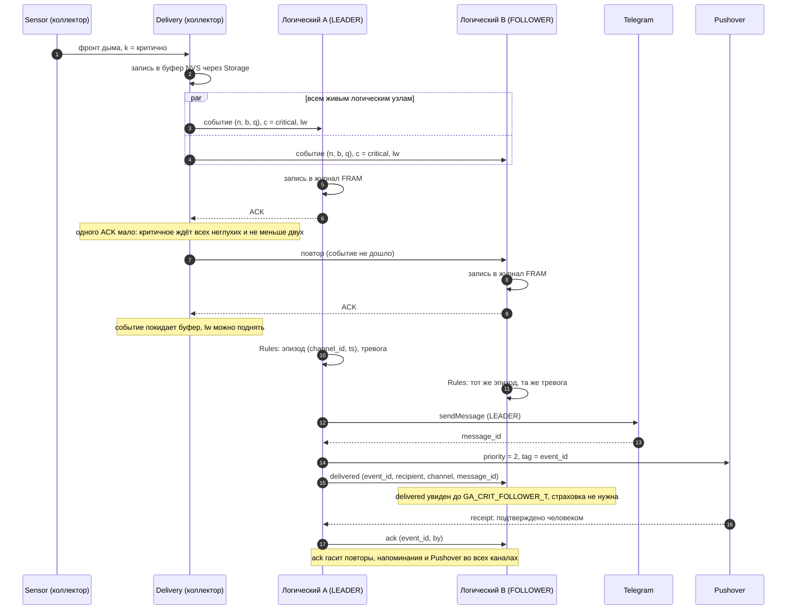
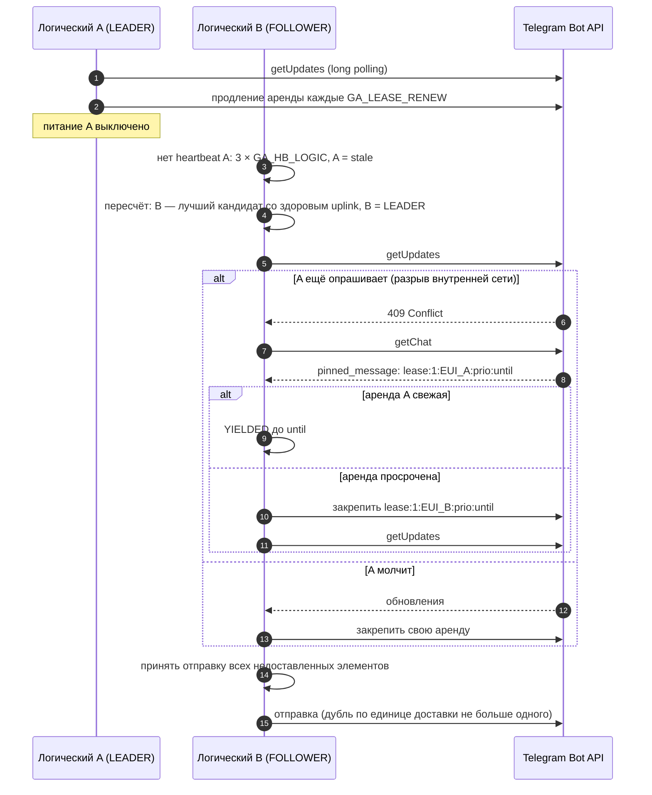
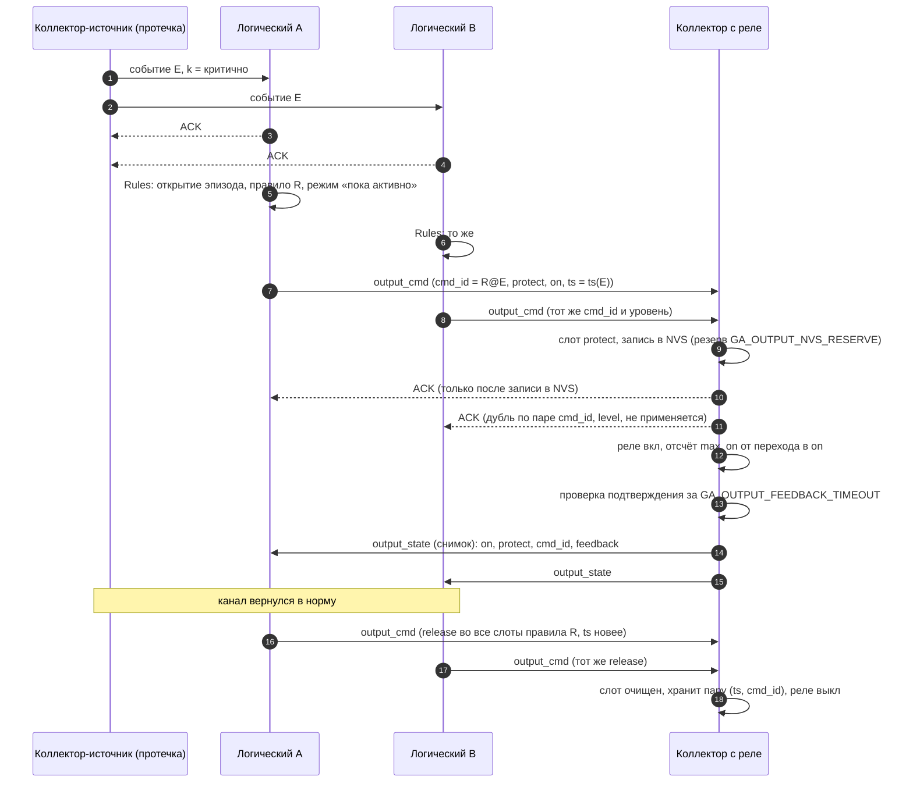
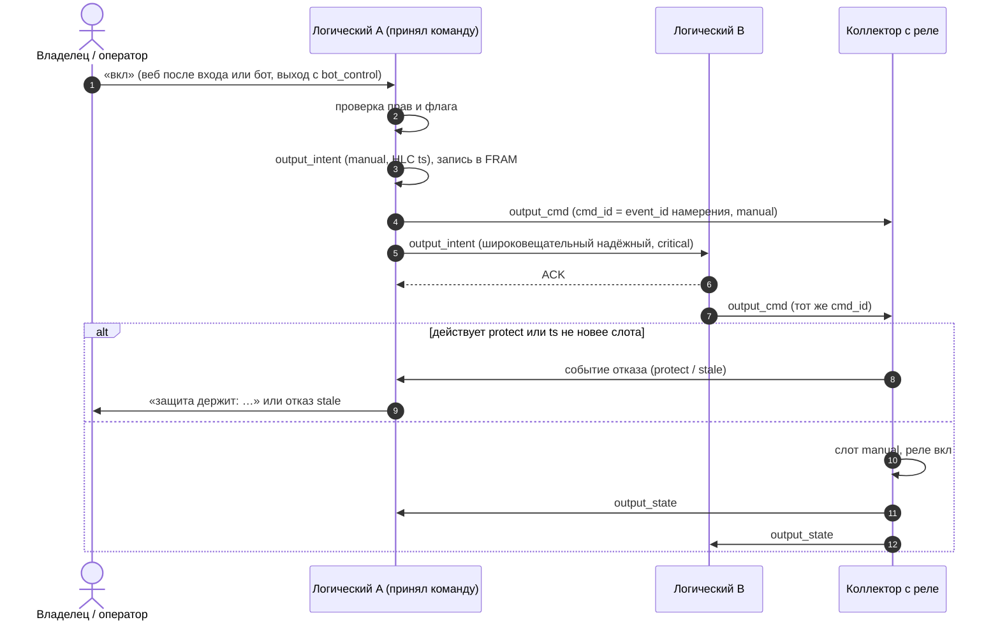
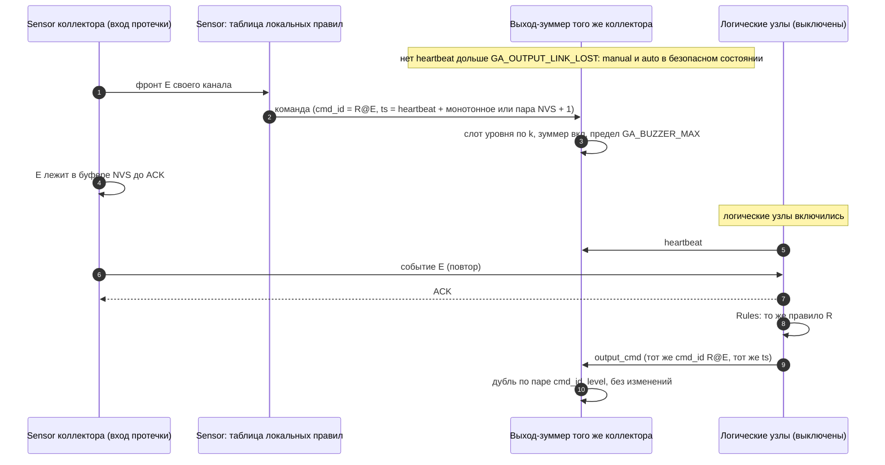
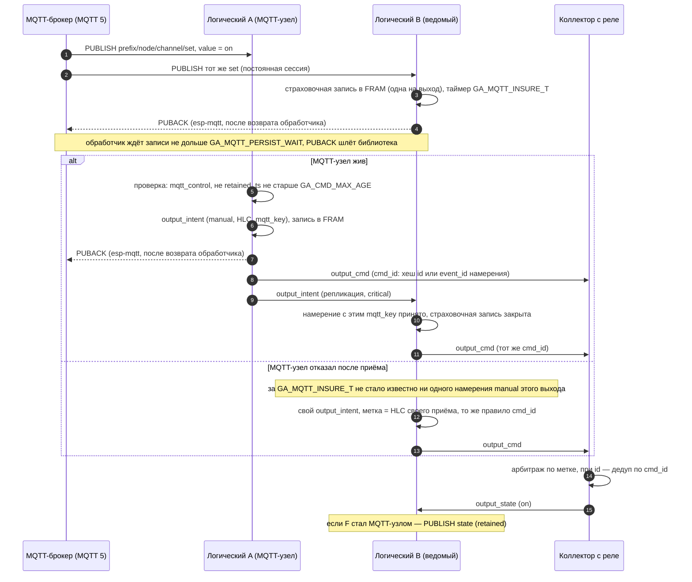

# garageAlarms 2.0 — протоколы распределённой системы

Справочник по межузловым и внешним протоколам сети тревог garageAlarms 2.0. Составлен 2026-10-05, обновлён 2026-10-06 (коммит 560df2a) только по документам планирования; ничего сверх них не добавлено. Где решение ещё не принято, стоит пометка **«не зафиксировано, решается в истории X»**.

**Источники и их сила**

| Документ | Статус | Как используется |
| --- | --- | --- |
| `ARCHITECTURE-SPINE.md` (AD-1…AD-29, редакция 2026-10-05 после ревью) | `final`, обязателен | **основной источник**, в том числе по выходам и MQTT |
| `sprint-change-proposal-2026-10-05.md` | утверждено 2026-10-05, применено | контекст выходов и MQTT; раздел 6 (итоги ревью) уточняет разделы 3 и 4.2 |
| `sprint-change-proposal-2026-10-04.md` | утверждено и применено | контекст: AD-26…AD-28, формат аренды, PIN |
| `SPEC.md` (14 CAP), `tunables.md`, `glossary.md`, `external-channels.md`, `sensor-catalog.md`, `rule-templates.md` | контракт | возможности, константы, внешние каналы |
| `components/ga_config/include/ga_config.h` | код (история 1.1) | фактические имена и значения констант |
| `wire-format.md` (компаньон спецификации, 2026-10-06) | контракт | точная раскладка кадра, конверта и нагрузок, доказательство лимита 80 Б, хеши |
| `durability-contracts.md` (компаньон спецификации, 2026-10-06) | контракт | сводка надёжности по границам (§15) |
| `epics.md` | план | уточнения из критериев историй (формат аренды, NFR5, эпик 10) |

Правила, которые появились с выходами и входящим MQTT (AD-29, новые редакции AD-9/12/14/15/16/19/22/24/27), помечены **[2026-10-05]**. Где предложение от 2026-10-05 (разделы 3 и 4.2) расходится с каркасом, действует каркас: например, вместо `clean_start` — постоянная сессия MQTT 5, вместо страховки «последнего значения» — страховка каждого сообщения с отпечатком. Учтены обе доработки AD-29/AD-24 после ревью.

## Содержание

1. [Обзор системы](#s1)
2. [Кадр и конверт: байтовая раскладка (AD-5, AD-6, `wire-format.md`)](#s2)
3. [Идентичность и потоки (AD-7)](#s3)
4. [Транспорт и классы трафика (AD-12, AD-13)](#s4)
5. [Надёжная доставка (AD-8, AD-17)](#s5)
6. [Репликация между логическими узлами и журнал (AD-8, AD-28)](#s6)
7. [Членство и heartbeat (AD-19)](#s7)
8. [Лидерство, аренда Telegram, страховка, MQTT-узел (AD-9, AD-10, AD-11)](#s8)
9. [Внешняя доставка: единица доставки, `delivered`, `ack`, эпизоды (AD-21)](#s9)
10. [Синхронизация мягкого конфига (AD-14)](#s10)
11. [Правила (AD-16)](#s11)
12. [Выходы (AD-29)](#s12)
13. [MQTT (AD-24 в новой редакции)](#s13)
14. [Время, безопасность, ввод в сеть, OTA (AD-20, AD-17, AD-23, AD-18)](#s14)
15. [Контракты надёжности на границах](#s15)
16. [Таймеры и константы](#s16)
17. [Инварианты симулятора как свойства корректности (AD-27)](#s17)
18. [Открытые вопросы и противоречия](#s18)

---

<a id="s1"></a>

## 1. Обзор системы

### 1.1. Приоритеты и модель

- Порядок приоритетов в каждом решении: **не потерять событие > не флудить > остальное.**
- Модель AP: доступность важнее согласованности. Дубль допустим, потеря — нет. Доставка «хотя бы один раз».
- Хаба нет. Zigbee работает в режиме distributed security без координатора. Нет узла, отказ которого останавливает сеть.
- Консенсуса с кворумом (Raft/Paxos) и строгой согласованности нет (не-цель SPEC).

### 1.2. Узлы

| Вид узла | Железо | Память | Связь | Что делает |
| --- | --- | --- | --- | --- |
| Логический | ESP32-S3 (с PSRAM) + ESP32-H2 как Zigbee RCP по UART, раздельные антенны | FRAM на своей SPI-шине (MB85RS4MT 512 КБ, разметка на 256 КБ); секреты — зашифрованный NVS | Zigbee (через H2) + WiFi/UDP | реплика журнала событий, очереди, конфига и правил; веб; Telegram, Pushover, MQTT; только цифровые входы с антидребезгом; 2..N в сети |
| Коллектор | ESP32-H2 | NVS через `Storage` (бюджет `GA_COLLECTOR_NVS_BUDGET`) | только Zigbee | датчики (шины, аналог), пересылка по mesh; **[2026-10-05]** выходы (реле) и локальные правила |

Все узлы питаются от сети и в Zigbee являются роутерами (AD-13, NFR10). Выходы бывают только на коллекторах **[2026-10-05]**.

### 1.3. Акторы и размещение

Каждый актор — задача FreeRTOS, единственный владелец своего состояния; общение только сообщениями через входную очередь (AD-1). Запрос ↔ ответ по `corr_id`, события — по подписке.

| Актор | Слой | Владеет | Логический | Коллектор |
| --- | --- | --- | --- | --- |
| `Sensor` | драйверы | драйверы, каналы, сбор, антидребезг, кэш параметров своих каналов; **[2026-10-05]** выходы и их арбитраж, таблица локальных правил (коллектор) | ✔ | ✔ |
| `Mesh` | L1 | Zigbee-стек, UDP, кадрирование, выбор канала | ✔ | ✔ (только Zigbee) |
| `Delivery` | L2 | ACK, повтор, антиповтор, дедуп, буфер неподтверждённых, репликация исходных событий, курсоры потребителей журнала | ✔ | ✔ |
| `Membership` | L3 | таблица живых узлов, heartbeat, вычисление лидера (и **[2026-10-05]** MQTT-узла) | ✔ | ✔ (без лидера) |
| `Config` | L4 | мягкий конфиг, правила, подписчики, режимы, версии, слияние | ✔ | — |
| `Rules` | L5 | исполнение правил, окна, производные события | ✔ | — (локальные правила коллектора исполняет `Sensor`, §11.6) |
| `Notify` | внешний | исходящая очередь, Telegram (отправка и `getUpdates`), Pushover, receipts, `offset`, MQTT-зеркало, его буфер и **[2026-10-05]** приём команд MQTT | ✔ | — |
| `Ui` | внешний | веб, разбор и исполнение команд | ✔ | — |
| `Sys` | сквозной | OTA, watchdog, время, самодиагностика, ввод в сеть, секреты | ✔ | ✔ |
| `Storage` | сервис | FRAM (логический) / NVS (коллектор) | ✔ | ✔ |

Стрелка на схеме — «может отправлять запрос». Обратно идут только события по подписке: `Notify` → `Ui` (команды из `getUpdates`), `Delivery` → `Rules` и `Notify` (входящие события), `Delivery` → `Membership` (глухота узла), `Delivery` → `Sensor` (команды правил), `Config` → `Sensor` (параметры каналов). Все события, в том числе датчиков самого логического узла, проходят через `Delivery`: у `Rules` один вход (AD-2). **[2026-10-05]** Стрелка `Ui` → `Delivery` добавлена для `output_intent` ручных команд из веба и бота; намерения из MQTT идут по `Notify` → `Delivery`.



Распределение по ядрам S3 (AD-26): ядро 0 — WiFi, lwIP, `Notify`, `Ui`, `Sys`; ядро 1 — тракт тревоги: `Mesh` (задача стека Zigbee с UART к RCP и задача актора, UDP), `Delivery`, `Storage`, `Membership`, `Sensor`, `Rules`, `Config`. Приоритеты по убыванию: `Mesh` > `Delivery` > `Storage` > `Membership` = `Sensor` > `Rules` > `Config` > `Notify` > `Ui` > `Sys`, все ниже lwIP. Числа — `GA_TASK_*` в `ga_config.h`.

### 1.4. Слои стека

| Слой | Актор | Что решает |
| --- | --- | --- |
| L1 | `Mesh` | физический путь: Zigbee и/или UDP по классу `c`, кадрирование |
| L2 | `Delivery` | ACK, повторы, антиповтор, дедуп, буфер, обмен исходными событиями, журнал |
| L3 | `Membership` | кто жив, heartbeat, лидер, MQTT-узел |
| L4 | `Config` | мягкий конфиг: HLC, LWW, надгробия, водяной знак `W` |
| L5 | `Rules` | правила, окна, производные события, эпизоды, команды правил и выходов |
| внешний | `Notify`, `Ui` | Telegram, Pushover, MQTT, веб |

### 1.5. Топология



---

<a id="s2"></a>

## 2. Кадр и конверт (AD-5, AD-6, `wire-format.md`)

### 2.1. Единственный источник

Конверт, ID, HMAC, типы, классы трафика и версии протокола определены только в `components/proto`; обе прошивки собирают его. `proto` — чистый C без заголовков IDF и FreeRTOS, HMAC вызывается через порт (в тестах — подделка, на плате — адаптер mbedTLS). Контракт раскладки и доказательство лимита кадра — компаньон спецификации `wire-format.md`; в коде `proto.h` пока заглушка, наполняется в истории 1.2. Размеры ниже — в байтах CBOR при **максимальных** значениях полей в указанных границах.

### 2.2. Кадр `[body, kid, m]`

CBOR-массив из 3 элементов.

| Поле | Тип и граница | Макс. байт |
| --- | --- | --- |
| заголовок массива | 3 элемента | 1 |
| `body` | байтовая строка ≤ 255 Б (заголовок) | 2 + тело |
| `kid` | uint ≤ 23 | 1 |
| `m` | байтовая строка 8 Б: HMAC-SHA256 ключом `kid` (32 Б) над сырыми байтами `body`, усечённый до `GA_PROTO_MAC_BYTES` | 9 |
| **итого служебное** | | **13** |

Правила обработки:

- подпись считается над байтами `body` как они пришли, без каноникализации, и проверяется **до** декодирования;
- пересылающий узел передаёт `body` байт в байт и никогда не перекодирует;
- автор, повторяющий своё неподтверждённое событие, переподписывает тот же `body` текущим ключом;
- журнал логического узла хранит тело входящего события байт в байт, как пришло, с подписью (AD-28).

### 2.3. Конверт `body = [hdr, t, n, b, q, lwd, ts, p]`

Позиционный массив. Новые поля добавляются только в конец; узел N−1 пропускает лишние хвостовые элементы (AD-6). Поле из середины всегда присутствует.

| # | Поле | Тип и граница | Макс. байт |
| --- | --- | --- | --- |
| — | заголовок массива | 8 элементов | 1 |
| 0 | `hdr` | uint: `v` (3 бита, старшие) · поток (2 бита: широковещательный надёжный / адресный надёжный / ненадёжный) · класс `c` (2 бита: `sensor` / `critical` / `bulk`) · `k` (1 бит, критично) | 2 |
| 1 | `t` | uint; типы, идущие по Zigbee, — коды ≤ 23 | 1 |
| 2 | `n` | uint64, EUI-64 отправителя | 9 |
| 3 | `b` | uint32, загрузка | 5 |
| 4 | `q` | uint32, `seq` своего потока | 5 |
| 5 | `lwd` | uint32, `q − lw`; у ненадёжного потока 0 | 5 |
| 6 | `ts` | uint64, UTC мс; у команды выхода — стенка HLC команды | 9 |
| 7 | `p` | массив, нагрузка типа | см. §2.4 |
| | **итого без `p`** | | **37** |

**Кадр = 13 + 37 + `p` ≤ `GA_ZB_FRAME_MAX_BYTES` (80) ⇔ `p` ≤ 30 Б.**

- `v` 0…7 — мажорная версия; кадры с версией ниже `PROTO_MIN_VERSION` отвергаются. Четвёртое значение потока или класса в `hdr` — ошибка формата, кадр отвергается.
- Коды типов 0–23 зарезервированы за типами, идущими по Zigbee. Типы, которые по Zigbee не ходят, могут иметь коды > 23 и большие нагрузки (UDP, история 3.2).
- Незнакомые типы пропускаются (AD-6). Кодировщик отказывает (`PROTO_ERR_SIZE`) при выходе за границу поля или кадра.

### 2.4. Нагрузки, уже зафиксированные

| Сообщение | Поля `p` (позиционно, в скобках — макс. байт) | Макс. `p` | Макс. кадр |
| --- | --- | --- | --- |
| `output_cmd` | `cmd_id` bstr 8 (9) · `channel_id` ≤ 65535 (3) · `level` (2 бита) · `value` (2 бита) (1) · счётчик HLC ≤ 65535 (3) · `dur_s` ≤ 43200, 0 = нет (3) · заголовок (1) | 20 | **70** |
| `output_state` | `channel_id` (3) · `level` (2) · `value` (2) · подтверждение (2: нет входа / разомкнут / замкнут) · время неизвестно (1) — 7 бит (2) · `cmd_id` (9) · `wall_ms` слота (9) · счётчик HLC (3) · заголовок (1) | 27 | **77** |
| `output_intent` | `channel_id` (3) · `level` · `value` · вид ключа (2) · `dur_s` (3) · счётчик HLC (3) · `mqtt_key` bstr 8 или `null` (9) · заголовок (1) | 21 | **71** |
| состояние канала | `channel_id` (3) · вид (3 бита) · здоровье (3 бита) (2) · значение int64 или float (9) · заголовок (1) | 15 | **65** |
| часть `local_rules` | `version` uint32 (5) · часть (4 бита) · (частей − 1) (4 бита) (2) · правило или `null` для пустой таблицы (17) · заголовок (1) | 25 | **75** |
| правило в `local_rules` | `rule_id` (3) · канал-вход (3) · условие ≤ 255: вид фронта или номер порога канала, заданного источнику (AD-15), — числового значения нет (2) · канал-выход (3) · `level` · `value` (1) · режим ≤ 23 (1) · `dur_s` (3) · заголовок (1) | 17 | — |

Худший случай — `output_state`: 77 ≤ 80, запас 3 Б. `GA_LOCAL_RULES_MAX` ≤ 16 (4 бита на номер части).

**Охват.** Таблица покрывает сообщения выходов и состояние канала. Остальные типы, идущие по Zigbee (сводная запись слияния фронтов — история 2.4, heartbeat — 3.1, `ack`/`delivered` — 3.7 и т. д.), добавляют свою строку и тест размера в своей истории.

### 2.5. Ключ, `kid` и ротация

- Ключ сети HMAC — 32 Б (`GA_NET_KEY_BYTES`) на `kid`; подпись в кадре — 8 Б (`GA_PROTO_MAC_BYTES`).
- `kid` — 0…23 по кругу; это номер, а не версия ключа. Одновременно действуют не больше двух.
- **Ключ HMAC меняется только повторным вводом каждого узла** (USB или Bluetooth, AD-17). Между узлами (Zigbee, UDP) ключ не передаётся никогда, в том числе зашифрованным старым ключом; пакет ключей идёт только зашифрованным кодом с наклейки (AD-23).

**Смена ключа сети (AD-5, Q3 решён 2026-10-07):**

| Шаг | Что происходит |
| --- | --- |
| 1. Начало | владелец в локальном вебе (вход и подтверждение) нажимает «Сменить ключ сети»; узел генерирует новый ключ, `kid` и абсолютный срок `T_end` = сейчас + `GA_KID_TRANSITION` (7 сут) |
| 2. Пакет ключей | несёт старый и новый ключ, оба `kid` и `T_end` |
| 3. Повторный ввод узла | до `T_end` узел принимает оба `kid` и объявляет свои `kid` в сообщении здоровья heartbeat (AD-19) |
| 4. Переход (односторонний) | логический узел начинает подписывать новым, когда новый `kid` объявили **все** узлы из записей `node/<eui>` (не только живые) или владелец нажал «Завершить смену ключа»; коллектор — когда новый `kid` объявили все логические узлы из его heartbeat; к старому узел не возвращается |
| 5. До `T_end` | адресные сообщения узлу, не объявившему новый `kid`, подписываются старым |
| 6. После `T_end` | старый ключ удаляется; узел, не введённый заново, отрезан и сам показывает событие «введите узел заново» |

- Повторный ввод для смены ключа сохраняет воплощение, `boot`, буфер событий, слоты `protect`, счётчик зацикливания и журнал FRAM; меняются только поля ключей в записи provisioning, после ввода автор переподписывает свой буфер текущим ключом (AD-23).
- Пересылка тела со старым `kid`: **по UDP** — вкладывается в конверт, подписанный текущим ключом; **по Zigbee** — исходный кадр пересылается как есть, пока идёт `GA_KID_TRANSITION` (вложение не помещается в кадр).
- **Ключ Zigbee-сети при этом не меняется.** Его смена — одновременный повторный ввод всех узлов с перерывом связи (вне MVP). Украденный узел до неё сохраняет доступ к Zigbee, но не может подписать кадр.

### 2.6. Совместимость N / N−1 (AD-6)

- Версия протокола N понимает N−1; кадры с версией ниже `PROTO_MIN_VERSION` отвергаются; в пределах поддерживаемых версий алгоритм и длина подписи не ослабевают. Поля не удаляются и не меняют смысл внутри мажорной версии; новые поля — только в конец массивов.
- Событие незнакомого типа подтверждается, хранится и реплицируется как непрозрачный `body`. Маршрутизация и критичность берутся из `c` и `k` (в `hdr`), а не из типа.
- Экземпляр правила с незнакомым шаблоном не исполняется и помечается в вебе.
- Команда выхода не отправляется коллектору, в описании каналов которого нет этого выхода (AD-29).
- Прошивка N читает разметку FRAM N+1 (AD-28).

### 2.7. Типы сообщений

Ниже — типы, названные в источниках. Числовые коды типов назначаются в `proto` (история 1.2 и истории, вводящие тип); раскладка `p` зафиксирована пока только для типов из §2.4.

| Тип (по источникам) | Поток (§3) | Класс (§4) | Источник |
| --- | --- | --- | --- |
| Событие датчика — фронт (в т. ч. пересечение порога) | широковещательный надёжный | `critical` для тревог, иначе `sensor` | AD-8, AD-15 |
| Снимок состояния канала (последнее значение) | ненадёжный | `sensor` | AD-7, AD-8 |
| Описание каналов (по смене версии) | не указан | не указан | AD-15 |
| Событие здоровья (узел пропал, канал `stale`/`open`/`short`, глухой узел, разные `GA_CONFIG_VERSION`…) | широковещательный надёжный | `critical` для критичных каналов | AD-8, AD-19, AD-25 |
| Производное событие правила, открытие эпизода | широковещательный надёжный | не указан | AD-7, AD-21 |
| ACK доставки (транспортный) | ненадёжный | `critical` | AD-7, AD-12 |
| `ack{event_id, by}` — подтверждение человеком | широковещательный надёжный | `critical` | AD-7, AD-21 |
| `delivered` (с `message_id`) | широковещательный надёжный | `critical` | AD-7, AD-21 |
| heartbeat | ненадёжный | `critical` | AD-7, AD-12, AD-19 |
| Сводка «`(node, boot)` → принятые `seq`» и запрос недостающих | не указан | `bulk` | AD-8, AD-12 |
| Записи синхронизации мягкого конфига | адресный надёжный | `bulk` | AD-7, AD-12, AD-14 |
| Параметры каналов коллектора (с версией) | адресный надёжный | не указан | AD-7, AD-14 |
| Команда правила (опросить, burst-интервал; ID + TTL) | адресный надёжный | не указан | AD-7, AD-16 |
| **[2026-10-05]** `output_cmd` | адресный надёжный, повтор до ACK | `critical` | AD-29, AD-12 |
| **[2026-10-05]** `output_state` | снимок (последнее значение, AD-8) — ненадёжный | `critical` | AD-29, AD-12 |
| **[2026-10-05]** Отказ команды выхода, `fault` выхода | фронт (хранится до ACK) — широковещательный надёжный | не указан | AD-29 |
| **[2026-10-05]** `output_intent` (реплицируемое событие) | широковещательный надёжный | `critical` | AD-29, AD-12 |
| **[2026-10-05]** `local_rules` (таблица с версией, по частям) | адресный надёжный | `bulk` | AD-7, AD-16, AD-12 |
| OTA логических узлов | — | `bulk` по UDP | AD-12, AD-18 |
| OTA коллекторов (Zigbee OTA Upgrade cluster) | вне `proto` | `bulk` | AD-12, AD-18 |

`boot_ready` — внутреннее сообщение актору `Delivery`, не кадр (§3.2).

---

<a id="s3"></a>

## 3. Идентичность и потоки (AD-7)

### 3.1. Идентификаторы

| Что | Формат | Примечание |
| --- | --- | --- |
| Узел | EUI-64 Zigbee, в тексте — 16 hex | мягкий конфиг привязан к EUI-64 и `channel_id` |
| Существование узла | ключ мягкого конфига `node/<eui>` с номером воплощения | «забыть» — надгробие ключа; повторный ввод — новое воплощение (AD-23) |
| Событие | `(node, boot, seq)`, в тексте `node:boot:seq`; на проводе — поля `n`, `b`, `q` конверта | `seq` — номер в широковещательном надёжном потоке |
| Производное событие | `(rule_id, window_start)`, в тексте `rule_id@window_start` | `window_start = floor(ts_источника / длина_окна) × длина_окна` |
| Эпизод тревоги | `(channel_id, ts первого срабатывания)` | AD-21 |
| `channel_id`, `rule_id` | uint16 = слот узла-создателя (4 бита) · счётчик этого узла (12 бит); присваивает `Config` при создании, не переиспользуются | слот 0–15 логический узел получает при вводе и хранит в своей записи `node/<eui>`; два узла с одним слотом — конфликт в вебе и событие здоровья, второй вводится заново |
| **[2026-10-05]** `cmd_id` (8 Б на проводе) | первые 8 Б SHA-256 от канонического CBOR-массива | см. таблицу ниже |
| **[2026-10-05]** Метка команды выхода | пара HLC (`wall_ms`, счётчик): `wall_ms` — поле `ts` конверта, счётчик — в нагрузке | построение — §12.2 |

**Хеши** (`wire-format.md`). Канонический CBOR — минимальная длина целых, байтовые строки как есть; тестовые векторы — в `proto/test`.

| Хеш | Вход SHA-256 (канонический CBOR-массив), первые 8 Б |
| --- | --- |
| `cmd_id` команды правила (текстовая запись `rule_id@event_id` причины) | `[rule_id, n, b, q]` причины; причина — исходное событие, у оконного правила — производное событие |
| `cmd_id` ручной команды (= `event_id` намерения) | `[n, b, q]` намерения |
| `cmd_id` команды MQTT с `id` | `[тема, id]` |
| отпечаток сообщения MQTT | `[тема, payload]` |

`mqtt_key` в `output_intent`: при `id` — тот же хеш, что `cmd_id` (вид ключа = id), иначе отпечаток (вид ключа = отпечаток). По `mqtt_key` ведомый решает, нужна ли страховка (§13.2).

### 3.2. Счётчик загрузок

- `boot` — постоянный счётчик; увеличивается и записывается синхронно в `app_main` до создания задач акторов.
- `Delivery` не отправляет ни одного кадра до сообщения `boot_ready`.

### 3.3. Три потока `seq`

Каждый поток начинается с 0 в каждой загрузке; поток указан в `hdr`.

| Поток | Что несёт | Антиповтор (AD-17) |
| --- | --- | --- |
| Широковещательный надёжный | события, `ack`, `delivered`; его номер и есть ID события; **[2026-10-05]** `output_intent`, отказы и `fault` выходов | окно `GA_SEQ_WINDOW` |
| Адресный надёжный | отдельный счётчик на пару `(src, dst)`: синхронизация конфига, параметры каналов коллектора, команды правил, **[2026-10-05]** `output_cmd`, `local_rules` | окно на поток |
| Ненадёжный | heartbeat, снимки (в т. ч. **[2026-10-05]** `output_state`), ACK | не подлежит; свежесть по `(boot, seq)` своего потока, не по часам, с ключом объекта (узел, тип, объект — канал, выход, номер части); `lwd` = 0 |

Адресные и ненадёжные сообщения не блокируют антиповтор у других получателей. Более старый снимок того же объекта никогда не заменяет более новый. Порядок снимков — по выпуску у владельца (`boot`, `seq`), не по метке слота: действующим может стать слот с более старой меткой. Получатель хранит во FRAM максимальный известный `boot` каждого узла и отбрасывает снимки и сообщения `lw` с меньшим `boot`.

### 3.4. `lw` (low-water)

`lw` передаётся в конверте разностью `lwd = q − lw`. Отправитель объявляет, что номера ниже `lw` в этом потоке он больше никому не повторит. **`lw` — не признак завершения доставки** и не основание удалять событие (§5.5). `lw` по незакрытым загрузкам дополнительно идёт в heartbeat (§7).

---

<a id="s4"></a>

## 4. Транспорт и классы трафика (AD-12, AD-13)

### 4.1. Zigbee

- Distributed security, без координатора; все узлы — роутеры (AD-13).
- Параметры сети и ключ приходят при вводе в сеть (AD-17).
- На логическом узле радио — H2 как RCP по UART; на коллекторе — нативный стек H2. Радио скрыто за интерфейсом `Mesh`.
- Предел одного кадра — `GA_ZB_FRAME_MAX_BYTES` = 80 Б.

### 4.2. UDP

- Второй путь между логическими узлами через роутер; подписан тем же HMAC.
- Коллекторы UDP не имеют.
- При выключенном роутере связь логических узлов идёт по Zigbee.
- Порт, unicast/широковещание, обнаружение пиров, предельный размер кадра по UDP — **отложено в историю 3.2** (Deferred). Доставка и повторы — те же правила AD-8 и AD-17, что для Zigbee.
- Только по UDP тело со старым `kid` вкладывается в новый конверт (§2.5); типы, не идущие по Zigbee, могут иметь коды > 23 и нагрузки больше 30 Б.

### 4.3. Классы трафика

Канал выбирает только `Mesh` по полю `c`.

| Класс | Что входит | Путь |
| --- | --- | --- |
| `sensor` | данные датчиков | Zigbee |
| `critical` | тревоги, ACK, `delivered`, `ack`, heartbeat; **[2026-10-05]** `output_cmd`, `output_state`, `output_intent` | Zigbee **и** UDP одновременно (у коллектора — только Zigbee); получатель отсеивает дубль |
| `bulk` | синхронизация конфига и исходных событий, **[2026-10-05]** таблица `local_rules`, OTA логических узлов, OTA коллекторов по Zigbee | UDP; по Zigbee — только при недоступности UDP и с ограничением скорости; OTA коллекторов уступает кадрам `critical` |

Предел скорости `bulk` по Zigbee `GA_BULK_ZB_RATE`, длина его очереди и противодавление — **задаются в истории 3.2** (Deferred); `bulk` всегда уступает `critical`.

---

<a id="s5"></a>

## 5. Надёжная доставка (AD-8, AD-17)

### 5.1. Коллектор → все живые логические узлы

- Коллектор отправляет событие **каждому** логическому узлу, которого `Membership` считает живым, и повторяет до ACK.
- Список логических узлов коллектор узнаёт только из heartbeat.
- Логический узел подтверждает (ACK) только после записи события в журнал (AD-4, AD-28).
- Повтор уже принятого события получает ACK заново и дальше не передаётся.
- Интервалы и паузы повторов — экспоненциальная пауза (Consistency Conventions); числа **не зафиксированы (Deferred, история 2.4 / 3.3)**.



### 5.2. Когда событие покидает буфер коллектора

| Событие | Условие освобождения |
| --- | --- |
| любое | только после ACK **хотя бы одного** логического узла |
| некритичное | плюс: подтвердили все живые **или** прошёл `GA_ACK_ALL_TIMEOUT` (5 мин) |
| критичное | подтвердили все живые **неглухие** логические узлы, и не меньше двух, если неглухих два и больше |

- Пока версия параметров каналов не подтверждена логическим узлом (AD-14), коллектор хранит все свои фронты как критичные.
- Неподтверждённое критичное не вытесняется и не удаляется по числу попыток.

### 5.3. Глухой узел

- Логический узел, живой по heartbeat, но не подтвердивший ни одного кадра за `GA_ACK_ALL_TIMEOUT` и не меньше `GA_DEAF_MIN_RETRIES` (10) повторов, коллектор объявляет глухим.
- Одно критичное событие здоровья на эпизод глухоты («🔧 Узел «<имя>» не принимает события»); узел исключается из ожидаемых.
- Первый ACK снимает глухоту.
- Исключение из ожидаемых ACK (глухой, пропавший узел) не освобождает узел от событий: вернувшись, он добирает недостающее обменом с другими логическими узлами (§6.1). Цепочка надёжности: коллектор забывает событие только после ACK, ACK — это запись во FRAM, обмен доводит событие до каждого живого логического узла.

### 5.4. Буфер коллектора и слияние

- Хранится в NVS через `Storage`, бюджет записей `GA_COLLECTOR_NVS_BUDGET` (2000/сут) — это бюджет износа, а не места.
- При исчерпании бюджета:

| Что | Политика |
| --- | --- |
| первый критичный фронт канала | пишется всегда, сверх бюджета |
| сводная запись слияния критичных | не чаще раза в `GA_COLLECTOR_CRIT_MERGE_PERSIST` (60 с); между записями счётчик и последний фронт живут в RAM |
| квоты остальных | записи критичного сверх бюджета их не уменьшают |
| слоты `protect` | из своего резерва `GA_OUTPUT_NVS_RESERVE` |
| `hold` | по своей квоте `GA_OUTPUT_HOLD_WRITES_DAY`, затем выход в «выкл» |
| параметры каналов, таблица локальных правил | пишутся как обычно (редкие правки) |
| некритичные фронты | только в RAM, с событием здоровья |
| снимки | в NVS не пишутся никогда |

- Снимки состояния хранят только последнее значение канала.
- Порядок вытеснения при переполнении: снимки → старейшие некритичные фронты. Критичное не вытесняется.
- Сверх `GA_COLLECTOR_CRIT_PER_CHANNEL` (4) критичные фронты одного канала сливаются в сводную запись: первый, последний и счётчик; место — резерв `GA_COLLECTOR_CRIT_RESERVE` (32 события).
- Сводная запись получает новый `seq`, несёт диапазон поглощённых номеров (включая прежний номер перевыпущенной сводной записи) и сама требует ACK.

### 5.5. Антиповтор и правила `lw` (AD-17)

**Окно получателя.** На каждый надёжный поток — окно принятых `seq` размером `GA_SEQ_WINDOW` (512).

- База окна = max(непрерывный префикс принятых, `lw` этого потока из кадра); база никогда не уменьшается.
- Кадр за пределами окна не подтверждается — отправитель повторит.
- Непринятое никогда не считается дублем.
- Повтор принятого получает ACK заново и дальше не передаётся.

**Когда отправитель поднимает `lw`.** Только за номерами, которые он больше **никому** не повторит и содержимое которых учтено:

| Случай | Условие |
| --- | --- |
| широковещательное событие | покинуло буфер по правилам выпуска AD-8 (§5.2); критичное — только после ACK всех живых неглухих логических узлов и не меньше двух |
| некритичное | вытеснено |
| фронт | поглощён слиянием (сводная запись несёт диапазон) |
| адресное сообщение | подтвердил получатель, истёк TTL или заменено новой версией |

Ограничения:

- `lw` не перекрывает неподтверждённое критичное, содержимое которого не перенесено в другую запись буфера;
- `lw` ограничивает только окно антиповтора, а не обмен недостающими между логическими узлами (§6);
- продвижение `lw` — **не признак завершения доставки** и не основание удалять событие; удаление решает только AD-8.

### 5.6. Приём через перезагрузки: `accept(node, boot, seq)`

`lw` относится к тройке (узел, загрузка, поток). Получатель хранит окна последних `GA_DEDUP_BOOTS` (4) загрузок узла.

| Загрузка кадра | Решение |
| --- | --- |
| текущая | решает окно |
| новее текущей | новая загрузка: открывается новое окно (номер загрузки только растёт) |
| известная прошлая | решает её окно; если окна уже нет — `seq` ≥ её `lw` из последнего heartbeat отправителя |
| неизвестная, старше хранимых | принимается, только если загрузка не закрыта и `seq` ≥ её `lw` из сообщения `lw` текущей загрузки отправителя |
| неизвестная, данных о её `lw` ещё нет | кадр **не подтверждается** и не засчитывается в глухоту; получатель запрашивает список `lw` адресно |
| закрытая | не принимается |

- **Закрытие загрузки:** её номер меньше `min_open_boot` из ядра heartbeat отправителя или её `lw` дошёл до конца загрузки. Отсутствие загрузки в списке — не признак закрытия.
- **`lw` прошлых загрузок после перезагрузки отправителя** = минимальный `seq` её записей в NVS. Номера, которых в NVS нет (некритичное только в RAM), считаются вытесненными; загрузка без записей в NVS закрыта.
- **`accept()` действует только на кадры, полученные напрямую от узла-источника.** Событие, пришедшее обменом от логического узла, принимается по подписи источника и дедупу по `event_id` журнала; закрытость и `lw` на него не действуют, от повтора его защищает антиповтор потока пира. Событие из обмена с `ts` старше начала журнала получателя записывается без эффектов.
- Перезагрузка коллектора с неподтверждённым событием не теряет его: событие прошлой загрузки повторяется и принимается.
- На логическом узле точка фиксации — запись журнала; окно дедупа выводится из журнала (AD-28).

---

<a id="s6"></a>

## 6. Репликация между логическими узлами и журнал (AD-8, AD-28)

### 6.1. Обмен исходными событиями (anti-entropy)

- Логические узлы обмениваются сводками «`(node, boot)` → принятые `seq`» и запрашивают недостающее.
- Сводка ограничена журналом того, у кого событие есть, а не `lw`. Источник — любой узел, у которого событие есть; глухой и пропавший узел тоже добирает.
- Событие из обмена принимается по подписи источника и `event_id` (§5.6).
- Класс `bulk`; повторная синхронизация не создаёт дублей.
- Цель: все логические узлы считают правила из одного и того же множества исходных событий (AD-16).
- Период `GA_SYNC_PERIOD`, формат сводки и запроса, предел событий за проход `GA_SYNC_MAX_EVENTS` — **отложено в историю 3.5** (Deferred). Что сравнивается, зафиксировано в AD-8.
- Синхронизация конфига к одному пиру идёт адресным потоком `(src, dst)`; медленный пир не останавливает приём у третьего узла.

### 6.2. Журнал событий

| Свойство | Значение |
| --- | --- |
| Регион | «Журнал входящих = история событий», владелец `Delivery`, 96 КБ (`GA_FRAM_INBOX`) |
| Вид | кольцо, только добавление |
| Тело события | хранится байт в байт как пришло, с подписью |
| Заголовки | бинарные с версией; содержимое — CBOR |
| Порядок записи | тело с CRC → сдвиг указателя головы (две копии с номером и CRC) → подтверждение `Storage` → ACK |
| Восстановление | отбрасывается только недописанное после зафиксированной головы; битая запись внутри — пропуск с событием здоровья |

### 6.3. Курсоры потребителей

- Курсор «обработано» каждого потребителя журнала хранит `Delivery`: `Rules` (события), `Notify` (`ack`, `delivered`, производные), `Config` (записи синхронизации конфига).
- Потребитель сдвигает курсор после подтверждения всех своих эффектов.
- Журнал не вытесняет дальше минимального курсора. Порядок вытеснения: обработанное старше окна → обработанное в окне (событие здоровья «история правил неполна») → необработанное **никогда**.
- Глубина журнала ≥ `GA_RULE_WINDOW_MAX` по `ts` источника.

### 6.4. Регионы FRAM, влияющие на протокол

| Регион | Владелец | Старт | Константа |
| --- | --- | --- | --- |
| Суперблок A/B | `Storage` | 2 × 256 Б | `GA_FRAM_SUPERBLOCK`, `GA_FRAM_SUPERBLOCK_COPIES` |
| Состояние узла (`boot`, время уведомлений о перезагрузке) | `Sys` | 256 Б | `GA_FRAM_SYS_STATE` |
| Журнал входящих | `Delivery` | 96 КБ | `GA_FRAM_INBOX` |
| Дедуп `(node, boot)` → окно `seq` | `Delivery` | 3 КБ | `GA_FRAM_DEDUP` |
| Исходящая очередь и единицы доставки | `Notify` | 32 КБ | `GA_FRAM_OUTBOX` |
| Состояние `Notify` (`offset`, `update_id`, receipts, индекс `ack`/`delivered`/`message_id`; журнал страховочных записей MQTT ≤ `GA_MQTT_INSURE_MAX` × ~64 Б + уплотнение) | `Notify` | 8 КБ | `GA_FRAM_NOTIFY_STATE` |
| Мягкий конфиг | `Config` | 48 КБ | `GA_FRAM_CONFIG` |
| Буфер MQTT | `Notify` | 24 КБ | `GA_FRAM_MQTT` |
| Статистика 7 дней | `Membership` | 4 КБ | `GA_FRAM_STATS` |
| Резерв под миграцию | — | остаток | — |

Разметку определяет суперблок; константы используются только при первом форматировании. Миграция только добавляет или растит регионы и идёт после самоподтверждения новой прошивки.

---

<a id="s7"></a>

## 7. Членство и heartbeat (AD-19)

### 7.1. Heartbeat — набор сообщений

Heartbeat — набор сообщений ненадёжного потока, каждое в один Zigbee-кадр. Класс `critical` (у коллектора — только Zigbee); свежесть — по `(boot, seq)` с ключом объекта (§3.3).

| Сообщение | Поля | Кто несёт | Зачем |
| --- | --- | --- | --- |
| ядро | роль, статус (`LEADER` / `FOLLOWER` / `YIELDED` / `ISOLATED`), uplink, `uplink_since`, `leader_priority`, `GA_CONFIG_VERSION` | все (uplink и приоритет — логический) | выбор лидера (AD-9), расхождение версий — событие здоровья (AD-25) |
| ядро | `mqtt_up` | логический | выбор MQTT-узла |
| ядро | `min_open_boot` | все | закрытие прошлых загрузок (§5.6) |
| ядро | версия параметров каналов, версия таблицы локальных правил | коллектор | повышение `k` при расхождении (AD-14), расхождение таблицы видно в вебе |
| отдельное сообщение | водяной знак конфига `W` | логический | надгробия, догон конфига (AD-14) |
| сообщения `lw` по частям | `lw` незакрытых загрузок | все | приём через перезагрузки (AD-17) |
| сообщения здоровья | здоровье каналов, флаги наличия внешних секретов (без самих секретов), объявленные `kid` (AD-5), время отправителя | все (флаги — логический) | `stale`/`open`/`short`; коллектор берёт время из heartbeat (AD-20) |

Раскладка каждого сообщения и тест размера — **история 3.1** (строка в `wire-format.md`).

### 7.2. Интервалы и обнаружение пропажи

| Параметр | Константа | Значение |
| --- | --- | --- |
| Период heartbeat логического узла | `GA_HB_LOGIC` | 10 с |
| Период heartbeat коллектора | `GA_HB_COLLECTOR` | 30 с |
| `stale` узла или канала | `GA_STALE_MISSED_HB` | 3 пропущенных heartbeat |

- Пропавший узел, канал в `stale`/`open`/`short` — событие шаблона «здоровье»; критичное, если на узле или канале есть критичное.
- Существование узла выводится из ключа `node/<eui>` мягкого конфига (AD-23).
- Ежедневный heartbeat-отчёт владельцу и всем подписчикам (`GA_DAILY_REPORT_TIME`, 09:00) делает молчание значимым.
- **[2026-10-05]** Коллектор с выходами переводит слоты `manual` и `auto` в безопасное состояние после `GA_OUTPUT_LINK_LOST` (90 с) без heartbeat логических узлов (§12.5).
- **[2026-10-05]** Логический узел, увидевший новый `boot` коллектора (поле `b` его heartbeat), шлёт ему последнюю известную команду каждого слота каждого выхода, включая `release` и `off`. До первого heartbeat после загрузки коллектор держит `manual` и `auto` в безопасном состоянии.
- **[2026-10-05]** Время из heartbeat задаёт `ts` команд локальных правил коллектора (§12.5).

---

<a id="s8"></a>

## 8. Лидерство, аренда Telegram, страховка, MQTT-узел

### 8.1. Выбор лидера (AD-9)

Каждый логический узел вычисляет лидера сам по данным heartbeat:

1. кандидаты — логические узлы со здоровым uplink;
2. минимальный `leader_priority`;
3. затем минимальный EUI-64.

| Правило | Значение |
| --- | --- |
| uplink | бинарный с гистерезисом: потерян после `GA_UPLINK_LOST` (60 с неудач), восстановлен после `GA_UPLINK_RESTORED` (120 с успеха) |
| возврат лидерства лучшему по приоритету | только при `uplink_since` ≥ `GA_LEADER_RETURN` (15 мин) |
| ручное назначение | `leader_override{node, until}` в мягком конфиге; действует сразу до `until` или отмены |
| старт | узел без пиров, но с uplink — `LEADER`, но не раньше `GA_JOIN_GRACE` (30 с); до этого или до первого heartbeat пира — `FOLLOWER` |

| Статус | Что делает |
| --- | --- |
| `LEADER` | отправляет наружу, `getUpdates`, держит аренду; сервер OTA коллекторов; источник времени без NTP |
| `FOLLOWER` | копия очереди; страхует критичное через `GA_CRIT_FOLLOWER_T` |
| `YIELDED` | после 409: нет `getUpdates` и некритичной отправки |
| `ISOLATED` | нет пиров и нет uplink: только копит |

### 8.2. Аренда Telegram и 409 (AD-10)

- В Telegram и Pushover отправляет и делает `getUpdates` (long polling) только `LEADER`; MQTT обслуживает MQTT-узел (§8.4, §13).
- `LEADER` держит в чате владельца закреплённое сообщение-аренду `lease{node, priority, until}`, продлевает каждые `GA_LEASE_RENEW` (5 мин), срок `GA_LEASE_TTL` (15 мин).
- Машинная часть — вторая строка сообщения: `<code>lease:1:<eui64>:<priority>:<until_epoch></code>`; аренда с незнакомой версией формата считается просроченной (история 3.9).
- 409 на `getUpdates` значит только «есть второй опрашивающий». Узел читает аренду через `getChat.pinned_message`:
  - свежая и чужая → `YIELDED` до её истечения;
  - просрочена → забирает её;
  - аренды нет → `YIELDED` на `GA_YIELD_BASE` × (1 + ранг), `GA_YIELD_BASE` = 30 с.
- **Ранг** — позиция узла среди живых логических узлов в порядке выбора лидера (`leader_priority`, затем EUI-64), с 0.
- В `YIELDED` нет `getUpdates` и некритичной отправки. Некритичное `LEADER` отправляет, только пока до конца его аренды остаётся не меньше `GA_LEASE_RENEW`.
- Критичное отправляется и без аренды (`YIELDED`, страховка AD-11). Внешний API не идемпотентен: падение между отправкой и `delivered` даёт внешний дубль — это допущено (не потерять > не флудить); Pushover гасит копии по `tag`.
- Узел, ставший `LEADER`, принимает отправку всех недоставленных элементов.

**Команды Telegram без повторного исполнения:**

- `offset` реплицируется как максимум; множество выполненных `update_id` — как объединение с обрезкой до старших `GA_TG_EXECUTED_IDS` (64).
- Оба сохраняются и реплицируются **до** исполнения команды. Исполнение — после подтверждения `offset` хотя бы одним живым пиром; без пиров — после записи в FRAM.
- Не исполняется команда: с известным `update_id`; с `update_id` ≤ минимального в множестве; с `date` старше `GA_CMD_MAX_AGE` (10 мин).
- Узел без состояния `Notify` от пиров начинает с `offset = −1` и полученное последнее обновление не исполняет — только если за `GA_JOIN_GRACE` не услышан ни один пир, а аренда просрочена или отсутствует.



### 8.3. Страховка критичного (AD-11)

- `FOLLOWER` или `YIELDED`, не увидевший `delivered` по всем единицам доставки критичного события за `GA_CRIT_FOLLOWER_T` × (1 + ранг) (`GA_CRIT_FOLLOWER_T` = 45 с; у `FOLLOWER` при живом лидере — просто `GA_CRIT_FOLLOWER_T`), отправляет недоставленные единицы сам и публикует `delivered`. Увидев `delivered`, не отправляет. Задержка по рангу разводит страхующих во времени.
- Mute никогда не глушит критичное.
- Если открытие эпизода слито с уже доставленным, страховка AD-11 не применяется (§9.4).

### 8.4. Роль «MQTT-узел» [2026-10-05]

- Вычисляется отдельно от лидера: среди логических узлов с `mqtt_up` берётся минимальный `leader_priority`, затем минимальный EUI-64.
- `mqtt_up` — гистерезис `GA_MQTT_UP_LOST` (30 с) / `GA_MQTT_UP_RESTORED` (60 с); объявляется в heartbeat.
- Интернет для роли не нужен — работает с локальным брокером.
- MQTT-узел публикует зеркало и создаёт `output_intent` по командам MQTT (§13).

---

<a id="s9"></a>

## 9. Внешняя доставка (AD-21, AD-22)

### 9.1. Единица доставки

- Единица доставки — `(event_id, recipient, channel)`.
- `delivered` публикует тот узел, который отправил, по каждой единице, вместе с `message_id`. Это реплицируемое событие широковещательного надёжного потока.
- Исходящий элемент удаляется, когда все единицы доставлены или окончательно отклонены.
- MQTT не входит в единицы доставки и не задерживает удаление исходящего элемента.

### 9.2. Исходящая очередь

- Всегда принимает элемент. При переполнении вытесняется старейший некритичный со сводкой «пропущено N».
- Критичным — квота `GA_OUTBOX_CRIT_QUOTA` (25 % очереди); сверх неё критичные элементы одного канала сливаются в один с «+N».
- Хранится журналом с уплотнением в регионе `Notify` (32 КБ).
- `Notify` идемпотентен по `event_id` в пределах `GA_RULE_WINDOW_MAX` + `GA_NOTIFY_IDEMP_MARGIN` (1 ч + 15 мин). Перезагрузка не повторяет уже доставленные уведомления.

### 9.3. Подтверждение человеком

- Подтверждение в любом канале (кнопка «Принято», receipt Pushover) — реплицируемое событие `ack{event_id, by}`.
- Оно гасит повторы, напоминания и Pushover во всех каналах.

### 9.4. Эпизод тревоги

| Правило | Значение |
| --- | --- |
| Кто вычисляет | `Rules`, только по `ts` источника |
| Ключ | `(channel_id, ts первого срабатывания)`; после публикации не меняется |
| Публикация | открытие — производное событие через `Delivery` |
| Слияние | из пересекающихся открытий одного канала все узлы оставляют открытие с минимальным `ts`; остальные сливаются в него; выжившее наследует их единицы доставки, `message_id` и `ack`, их `event_id` — синонимы выжившего для `Notify` |
| Слитое уже доставлено | выжившее даёт только правку сообщения, без Pushover и без страховки AD-11 |
| Норма | неактивное значение при `health = ok` |
| Закрытие | после возврата в норму нет срабатывания с `ts` в течение `GA_ALARM_REARM` (10 мин); решение не раньше `GA_ALARM_REARM` + `GA_EPISODE_GRACE` (60 с) после нормы |
| Повтор в открытом эпизоде | правка сообщения тревоги («повторных срабатываний: N»); если правка невозможна — новое сообщение без Pushover |
| Новая тревога (с Pushover для критичного) | срабатывание после закрытия эпизода; позже `ack` + `GA_ALARM_REARM`; позже начала эпизода + `GA_EPISODE_MAX` (1 ч) |
| Mute | если первое срабатывание некритичного эпизода пришлось на mute, первое срабатывание после mute отправляется как тревога |
| Восстановление | `GA_EPISODE_MAX` ≤ `GA_RULE_WINDOW_MAX`, поэтому открытый эпизод всегда восстанавливается из журнала |
| Опоздавшее за горизонт | эпизоды не меняет, даёт отдельную тревогу «с опозданием» |

### 9.5. Pushover

- Только критичные события, на ключ группы Pushover.
- `priority=2` (emergency): retry `GA_PUSHOVER_RETRY` (60 с, не меньше 30 с), expire `GA_PUSHOVER_EXPIRE` (3 ч, не больше 3 ч).
- `tag = event_id`; лишние копии отменяются `cancel_by_tag`.
- Подтверждение по receipt → `ack`.

### 9.6. Telegram: права и правила отправки (AD-22)

- Подписка по PIN; владельца отписать нельзя. Команды принимаются только от подписанных чатов; отправитель — по `from.id`.
- Опасные команды (перезагрузка, лидер) — только от владельца и с подтверждением (`GA_CONFIRM_TTL`, 2 мин).
- Правила и конфиг — только локальный веб. Критичное правило выключается только там и временно (≤ `GA_CRIT_DISABLE_MAX`, 12 ч), с событием всем подписчикам.
- Каждое сообщение подписано узлом-отправителем и статусом (`🏠 гараж · ведущий`).
- Уведомления о перезагрузке — только владельцу, с причиной сброса; ≤ 1 за `GA_REBOOT_NOTIFY_UNEXPECTED` (15 мин) / `GA_REBOOT_NOTIFY_PLANNED` (6 ч).
- Между отправками — пауза `GA_TG_SEND_GAP` (350 мс).
- **[2026-10-05]** Выходами из бота управляют владелец и операторы, только выходами с флагом `bot_control` (кнопки «вкл / выкл / авто»); в вебе — после входа.

Команды бота: `/subscribe <PIN>`, `/unsubscribe`, `/status`, «Датчики», «События», «🔕 Моя тишина», `/test`, отчёты, «Принято», `/mute N` / `/unmute`, «Статистика», `/mode <режим>`, `/leader <узел>`, `/reboot`; **[2026-10-05]** экран «Выходы».

---

<a id="s10"></a>

## 10. Синхронизация мягкого конфига (AD-14)

### 10.1. Уровни

| Уровень | Что | Где меняется |
| --- | --- | --- |
| H (прошивка) | манифест датчиков (и **[2026-10-05]** выходов: пин, вход подтверждения), драйверы, шаблоны правил | перепрошивка |
| S (мягкий) | имена, зоны, назначение и `criticality` каналов, интервалы, пороги, экземпляры и наборы правил (`severity`), режимы, граф зон, `leader_priority`, `leader_override`, подписчики и владелец, окно mute, маршрутизация уведомлений, настройки MQTT; **[2026-10-05]** параметры выходов (`max_on`, безопасное состояние, флаги `mqtt_control` и `bot_control`) | веб, реплицируется |
| R (рантайм) | значения, здоровье | — |

### 10.2. Слияние

- Писатель S — только `Config`.
- Версия на ключ; слияние LWW по HLC `(wall_ms, counter, EUI-64)`.
- Удаление — надгробие, не стирание.
- Синхронизация передаёт записи в порядке HLC адресным надёжным потоком `(src, dst)`, класс `bulk`.
- Узел объявляет в heartbeat водяной знак `W`: «есть все записи с HLC ≤ `W`».
- Надгробие удаляется, когда оно старше `GA_TOMBSTONE_TTL` (30 сут) и `W` каждого живого логического узла не меньше его HLC.
- Конфликт одновременных правок одного ключа показывается в вебе.
- Правка на узле A видна на узле B за ≤ 1 мин (CAP-3).

### 10.3. Вернувшийся узел

- Отсутствие узла измеряют соседи.
- Узел, отсутствовавший дольше `GA_TOMBSTONE_TTL`, забирает конфиг у соседа с наибольшим `W`, работавшего всё это время; свои расхождения показывает в вебе как конфликты.
- Если такого соседа нет (отсутствовали все), узлы сливают конфиги обычным образом.

### 10.4. Параметры каналов коллектора

- Коллектор получает параметры своих каналов надёжным адресным сообщением с версией, хранит копию через `Storage`, сообщает её версию в heartbeat.
- Пока версия расходится — правила повышения `k` (§5.7), а коллектор хранит все фронты как критичные (§5.2).
- Пересечение порога, заданного каналу в S, источник выдаёт как фронт (хранится до ACK), а не как снимок (AD-15).
- **[2026-10-05]** Таблица локальных правил идёт коллектору так же (§11.6).

Формат записи синхронизации конфига и раскладка HLC конфига в кадре — **не зафиксировано, решается в истории 3.10**.

---

<a id="s11"></a>

## 11. Правила (AD-16)

### 11.1. Детерминизм

- Все экземпляры правил исполняются на **каждом** логическом узле детерминированно из одного и того же множества исходных событий по `ts` источника.
- Производное событие получает одинаковый ID `rule_id@window_start` на всех узлах; `Notify` отсеивает дубли по `event_id`.
- Правило = шаблон + экземпляр `{id, type, enabled, params, set, severity, notify, when?, ver}` + необязательное `when` (и/или/не, сравнения, режим, время, состояние; без циклов и переменных; ≤ 256 символов, ≤ 8 уровней), проверяемое при сохранении.
- Шаблоны: состояние/порог, скорость изменения, здоровье, совпадение, цепочка, трасса по графу зон, агрегация, действие/команда, режим/расписание.

### 11.2. Окна и восстановление

- Окно любого правила ≤ `GA_RULE_WINDOW_MAX` (1 ч), проверяется при сохранении.
- Состояние окон производное: после перезагрузки восстанавливается проходом журнала от `ts` курсора `Rules` минус `GA_RULE_WINDOW_MAX`. Эффекты при этом выдаются всегда; `Notify` отсеивает их по `event_id`.

### 11.3. Горизонт опоздания

- Событие с `ts` < `now − GA_RULE_WINDOW_MAX` обрабатывают только правила одного события (с пометкой «с опозданием»); оконные правила его не учитывают.
- Базовая тревога критичного канала — всегда правило одного события; горизонт на неё не действует.
- Опоздавшее событие эпизоды не меняет и даёт отдельную тревогу «с опозданием».

### 11.4. Команды правил

- Команды (опросить, burst-интервал) — адресные надёжные сообщения через `Delivery`; у получателя доходят до `Sensor` событием по подписке.
- Несут ID и TTL и откатываются сами (пример: интервал 1 с на 5 мин).

### 11.5. Действие «установить выход» [2026-10-05]

- Каждый логический узел шлёт `output_cmd` сам, без лидера (§12).
- Причина — исходное событие, у оконного правила — производное событие (AD-7). `cmd_id = rule_id@event_id` причины, `ts` = `ts` причины (у производного — `window_start`).
- Уровень `protect`, если итоговое `k` причины критично (с учётом повышения «`k` не ниже X»), иначе `auto`.
- `Rules` **не выдаёт** команд выходов при проходе журнала до своего курсора (восстановление после перезагрузки). Включающие команды (`on`, `pulse`) не выдаются и для причины с `ts` < `now − GA_CMD_MAX_AGE`; `release` и `off` выдаются всегда.
- `release` правила адресуется всем слотам, занятым командами этого правила; `release` по `ack` получает `ts` = max(`ts` подтверждения, `ts` включившей команды) + 1.
- У правил тревоги действие выхода срабатывает на **открытие эпизода** AD-21, а не на каждое срабатывание.
- Режим действия задаётся в правиле:

| Режим | Когда выход освобождается |
| --- | --- |
| «пока активно» | `release` при возврате канала в норму |
| «до подтверждения» | `release` по `ack` эпизода |
| «импульс» | команда `pulse` |

### 11.6. Локальные правила на коллекторе [2026-10-05]

Новая редакция AD-16: «Коллектор правил не исполняет» больше не действует.

- Коллектор исполняет только **локальные** правила: правило одного события своего канала с действием на свой выход, без окна и без `when`. `Config` помечает правило как локальное при сохранении; в вебе оно отмечено «локально на <узел>».
- Таблица локальных правил (≤ `GA_LOCAL_RULES_MAX` = 16) приходит коллектору адресным надёжным сообщением `local_rules` с версией, по частям (класс `bulk`).
- **Атомарная смена:** коллектор копит части отдельно от действующей таблицы, полную версию проверяет и пишет через `Storage` в неактивную копию A/B, затем переключает копии одной записью. До этого действует прежняя таблица; неполная версия отбрасывается при приходе более новой версии или перезагрузке.
- Версию действующей таблицы коллектор сообщает в heartbeat; расхождение видно в вебе.
- Таблицей владеет `Sensor` коллектора (таблица акторов каркаса).
- Команда локального правила несёт тот же `cmd_id`, что у логических узлов, и тот же `ts`, если коллектор знает время (иначе — §12.5). Узел выхода применяет её один раз по `cmd_id`.
- Логические узлы исполняют то же правило; всё остальное считают только они.

---

<a id="s12"></a>

## 12. Выходы (AD-29) [2026-10-05]

### 12.1. Канал-выход

- **Принцип.** Для любого реле «выключено» — безопасное положение, «включено» — временное состояние, всегда ограниченное `max_on` (снять предел нельзя). Нагрузка подбирается так, чтобы «выключено» было безопасно.
- **Защитный клапан протечки — только моторный шаровой:** питание нужно лишь на ход, положение он держит без питания; `protect` = `on` на время хода закрывает его. Соленоиды для защиты не используются: нормально-открытый откроет воду при сбое, нормально-закрытый пропускает воду только под постоянным питанием, а выход по `max_on`, при перезагрузке и при зацикливании уходит в «выкл» (`sensor-catalog.md`).
- Канал вида `output` (к `binary | numeric | counter | enum` добавлен `output`), подтип `switch | buzzer`.
- Только на коллекторе; в манифесте — пин и необязательный вход подтверждения (вторая пара контактов реле). Выход описывается тем же самоописанием каналов, что и датчики.
- Катушки реле 24 В — только через ключ (транзистор с диодом или ULN2003), от отдельного питания 24 В.
- Параметры в S: `max_on` (по умолчанию `GA_OUTPUT_MAX_ON_DEFAULT` = 1 ч, не больше `GA_OUTPUT_MAX_ON_MAX` = 12 ч; действует на всех выходах всегда и не снимается; меняется только в локальном вебе после входа и с подтверждением, никакая команда — правило, бот, MQTT — на него не влияет), безопасное состояние `off | hold`, флаги `mqtt_control`, `bot_control`.
- Совместимость N/N−1: команда выхода не отправляется коллектору, в описании каналов которого нет этого выхода.

### 12.2. Команда `output_cmd` и метка команды

```
output_cmd{cmd_id, channel_id, level, value: on|off|release|pulse, ts, dur_s}
```

| Поле | Смысл | На проводе (§2.4) |
| --- | --- | --- |
| `cmd_id` | 8 Б SHA-256 канонического CBOR-массива: `[rule_id, n, b, q]` причины; `[n, b, q]` намерения; `[тема, id]` для MQTT с `id` (§3.1) | bstr 8 |
| `channel_id` | выход, uint16 | ≤ 65535 |
| `level` | `protect` / `manual` / `auto` | 2 бита |
| `value` | `on`, `off`, `release` (очистить слот), `pulse` | 2 бита |
| `ts` | метка: `wall_ms` — поле `ts` конверта, счётчик HLC — в нагрузке | uint64 + uint ≤ 65535 |
| `dur_s` | длительность, с; 0 — нет | ≤ 43200 (`GA_OUTPUT_MAX_ON_MAX`); у `pulse` 0 < `dur_s` ≤ `GA_BUZZER_MAX` — `pulse` без длительности кодировщик отвергает (`PROTO_ERR_FORMAT`), узел выхода отклоняет |

- Адресное надёжное сообщение класса `critical`, целиком в одном Zigbee-кадре (≤ 70 Б), повторяется до ACK.
- **Срок команды** = стенка её метки + `dur_s`, если получатель знает время; иначе — от приёма по монотонным часам. Команда с уже прошедшим сроком не исполняется: отклонение `expired`, не отказ пользователю. TTL сообщения = срок команды; без `dur_s` — без TTL.
- Адресаты — коллекторы, поэтому `critical` здесь означает только Zigbee (AD-12).
- **Срок, слот и предел — три разных понятия.**

| Понятие | Что это |
| --- | --- |
| срок команды | `ts` + `dur_s` (`dur_s` = 0 — до замены): сколько команда действительна и сколько её повторяют до ACK |
| слот | живёт, пока его команда действительна или не заменена |
| `max_on` | физический предел включённого выхода: считается узлом по монотонным часам от перехода в `on`, не зависит от команд и сети |

  `max_on` действует на всех выходах всегда и не снимается. Срок по стенке HLC — приближение с точностью до расхождения часов; физическую безопасность даёт только `max_on`.
- Совпадение 64-битных `cmd_id` двух разных команд одного выхода допускается как вероятностное (≈ 3·10⁻⁸ при 10⁶ команд).
- В буфере отправителя команда заменяется только командой того же выхода и уровня с бо́льшей меткой (для `lw` это «заменено новой версией», AD-17).

**Метка команды — одна для всех источников.** Пара HLC (`wall_ms`, счётчик). Порядок двух команд одного слота — по (`wall_ms`, счётчик, `cmd_id`), побеждает бо́льшая, «новее» — строго больше. При переполнении счётчика `wall_ms` += 1, счётчик = 0.

| Источник | `wall_ms` | Счётчик |
| --- | --- | --- |
| правило логического узла | `ts` причины (у оконного — `window_start`) | 0 |
| `release` по `ack` | max(`ts` подтверждения, `ts` включившей команды) + 1 мс | 0 |
| ручная команда (веб, бот, MQTT) и страховка ведомого | HLC принявшего узла в момент приёма, не меньше последней известной ему пары этого выхода | по HLC |
| локальное правило | время последнего heartbeat + монотонное время | по HLC |
| локальное правило без heartbeat с загрузки | максимальная пара слотов из NVS | + 1, флаг «время неизвестно» |
| проход журнала | команд не выдаёт | — |
| повтор после перезагрузки коллектора | исходная метка без изменений — срок считается от неё, истёкшая команда не воскресает (`expired`) | без изменений |

Команда правила и её `release` поэтому одинаковы на всех логических узлах.

### 12.3. Арбитраж на узле выхода

Узел выхода — единственный владелец его состояния (AD-1).

| Слот (по убыванию) | Кто пишет | Где хранится |
| --- | --- | --- |
| `protect` | правила, у которых итоговое `k` причины критично | NVS через `Storage`, **до ACK**, из резерва `GA_OUTPUT_NVS_RESERVE` (8) вне бюджета событий — по одной записи на выход; выходов на коллекторе не больше резерва (static assert при сборке манифеста: `N_OUTPUTS ≤ GA_OUTPUT_NVS_RESERVE`); вместе с меткой, `cmd_id` и остатком `max_on`/срока |
| `manual` | веб, бот, MQTT через `output_intent` | RAM |
| `auto` | остальные правила | RAM |

Правила:

1. Команда, включая `release`, занимает слот своего уровня, только если она **новее** слота по (`wall_ms`, счётчик, `cmd_id`).
2. Очищенный (`release`), истёкший (срок команды) или отсечённый (`max_on`) слот хранит метку последней команды. Команда не новее её отклоняется с причиной `stale`.
3. `stale` с тем же значением, что уже действует, — не отказ. Отказ `stale` сообщается только источнику ручной команды (ответ бота или веба, `result` MQTT); отклонения команд правил пишутся в журнал без уведомления.
4. Действует старший слот со значением; без них выход выключен.
5. Дедуп по паре (`cmd_id`, `level`): повтор подтверждается и не применяется заново. Тот же `cmd_id` с более высоким уровнем — повышение: оно очищает нижний слот, сохраняя его пару.
6. Отказ (например, `manual` против действующего `protect`) — событие с причиной («защита держит: протечка подвала»).
7. Бот: кнопка «авто» отправляет `release` уровня `manual`, и выход возвращается правилам (история 10.4).

**Перезагрузка коллектора.**

- Слот `protect` восстанавливается из NVS; отсчёт `max_on` и срока продолжается с сохранённого остатка.
- **Счётчик зацикливания** хранится в NVS коллектора (вне бюджета событий, не больше одной записи за загрузку). Он увеличивается записью **до подачи уровня на пин** при первом включении любого выхода в течение `GA_OUTPUT_BOOT_STABLE` (10 мин) после загрузки; не пишется при значении ≥ `GA_OUTPUT_BOOT_LOOP`; сбрасывается после `GA_OUTPUT_BOOT_STABLE` непрерывной работы. «Подряд» — без стабильного периода между загрузками; отключение питания считается так же.
- На `GA_OUTPUT_BOOT_LOOP` (3) все слоты **всех** выходов, включая `protect` и `hold`, **без исключений** уходят в `off` с `fault` (критичное событие здоровья «защита снята»). Поэтому защитная нагрузка подбирается безопасной без питания.
- Через `GA_OUTPUT_BOOT_STABLE` в `fault` коллектор сообщает это в heartbeat, и логические узлы повторяют последнюю команду каждого слота, как при новом `boot`. Повторное зацикливание удваивает интервал до следующей попытки. `fault` можно снять и из веба.
- До первого heartbeat после загрузки коллектор держит `manual` и `auto` в безопасном состоянии. Коллектор, не знающий времени, команды логических узлов **не исполняет и не подтверждает** до первого heartbeat логического узла (отправитель повторит); исключение — локальные правила.
- Логический узел, увидевший новый `boot` коллектора по полю `b` его heartbeat, шлёт ему последнюю известную команду **каждого слота каждого выхода**, включая `release` и `off`, с её **исходной меткой** — повтор не воскрешает истёкшую команду. Эти команды узел выводит из журнала (намерения и срабатывания правил) и отдельно не хранит.

Итог: порядок прихода, дубли, перезагрузки и расходящиеся часы не возвращают старое значение (инварианты симулятора).

### 12.4. Источники команд

| Источник | Кто шлёт `output_cmd` | `cmd_id` | `ts` | Уровень |
| --- | --- | --- | --- | --- |
| Правило на логических узлах | каждый логический узел сам, без лидера | хеш `[rule_id, n, b, q]` причины | по таблице §12.2 | `protect` при критичном итоговом `k`, иначе `auto` |
| Локальное правило | сам коллектор | тот же | та же, если коллектор знает время; иначе — §12.2 | тот же |
| Ручная команда (веб, бот, MQTT) | принявший узел — сразу после записи `output_intent` в FRAM; остальные логические узлы — по приходу события | хеш `[n, b, q]` намерения; MQTT с `id` — хеш `[тема, id]` | по таблице §12.2 | `manual` |

- `output_intent` — реплицируемое событие класса `critical`: страховка ручной команды — обычная репликация событий. Намерение из MQTT несёт `mqtt_key` — хеш `id` или отпечаток (§3.1).
- `Rules` не выдаёт команд выходов при проходе журнала до своего курсора. Включающие команды (`on`, `pulse`) не выдаются для причины с `ts` < `now − GA_CMD_MAX_AGE`; `release` и `off` выдаются **всегда** — лишнее отсеет сравнение пар.
- `release` правила адресуется всем слотам, занятым командами этого правила.
- `release` по `ack` (режим «до подтверждения») получает `ts` по таблице §12.2.
- Права: веб — после входа; бот — владелец и операторы, только выходы с `bot_control`; MQTT — только выходы с `mqtt_control`.

### 12.5. Безопасность и время на узле выхода

- `max_on` и `GA_BUZZER_MAX` (5 мин) отсчитываются от перехода выхода в `on` и командами не перезапускаются. По истечении узел выключает выход сам, без сети, и публикует `output_state` с причиной.
- Срок команды — по §12.2; `max_on` и пределы считаются по монотонным часам узла.
- Безопасное состояние при старте и после `GA_OUTPUT_LINK_LOST` (90 с) без heartbeat логических узлов — `off | hold`; действует **только на слоты `manual` и `auto`**; `on` запрещён (отвергается при сохранении); `hold` хранится в NVS со своей суточной квотой записей `GA_OUTPUT_HOLD_WRITES_DAY` (200) внутри `GA_COLLECTOR_NVS_BUDGET`; при исчерпании квоты безопасное состояние выхода — `off` до конца суток, с событием здоровья. Локальные правила продолжают работать (история 10.1).
- Метка команды локального правила — §12.2; без времени она строится от сохранённых слотов, чтобы сохранённый слот не блокировал локальное правило.
- Подтверждение (вторая пара контактов), не совпавшее с командой за `GA_OUTPUT_FEEDBACK_TIMEOUT` (500 мс), переводит канал в `health = fault` и создаёт событие здоровья.

### 12.6. Состояние `output_state`

```
output_state{value, level, cmd_id, ts, feedback}
```

- На проводе (§2.4, ≤ 77 Б): `channel_id`, 7 бит (`level`, `value`, подтверждение: нет входа / разомкнут / замкнут, «время неизвестно»), `cmd_id`, `wall_ms` и счётчик действующего слота.

- `ts` — пара действующего слота.
- Снимок (только последнее значение, AD-8) по смене действующего слота или уровня; не по такту паттерна зуммера.
- Фронтами (хранятся до ACK) идут только отказы и `fault`.
- Класс `critical`.

### 12.7. Правило → реле



### 12.8. Ручная команда из веба или бота



### 12.9. Локальное правило при выключенных логических узлах



Если `ts(E)` уже старше `GA_CMD_MAX_AGE`, логические узлы включающую команду (`on`, `pulse`) не выдают — выход держит команда коллектора; `release` и `off` они выдают всегда.

---

<a id="s13"></a>

## 13. MQTT (AD-24 в новой редакции) [2026-10-05]

MQTT больше не «только выход»: принимаются команды выходам. Зеркало и команды обслуживает MQTT-узел (§8.4), не `LEADER`.

### 13.1. Подключение и темы

- Client ID узла — `ga2-<EUI-64>`, постоянный между перезагрузками и переподключениями.
- Брокер пользователя, MQTT 3.1.1 / 5; **команды выходов — только MQTT 5**. Библиотека `espressif/mqtt` 1.0.0.

| Тема | Направление | QoS | Retain | Содержимое |
| --- | --- | --- | --- | --- |
| `<prefix>/<node>/<channel>/state` | публикация | 1 | да | состояние канала; для выхода — подтверждённое значение после команды |
| `<prefix>/<node>/health` | публикация | 1 | да | здоровье узла |
| `<prefix>/events` | публикация | 1 | нет | события |
| `<prefix>/<node>/<channel>/result` | публикация | 1 | нет | отказ команды с причиной |
| `<prefix>/<node>/<channel>/set` | подписка | 1 | retained отбрасываются | команда выходу, JSON `{value, until?, ts?, id?}` |

- Публикация — JSON с `event_id`. Остальные поля JSON, разбор полей команды и перевод `until` из JSON в `dur_s` — **отложено в эпик 10** (Deferred; форма зафиксирована в AD-24).
- Публикует только MQTT-узел; остальные не публикуют. Дубль при смене MQTT-узла распознаётся по `event_id`.
- Подписки — только на `set`.

### 13.2. Приём команд

- Команды принимаются только для выходов с флагом `mqtt_control`.
- Все логические узлы с логином MQTT подписаны на `set` **постоянной сессией** MQTT 5: `clean_start = false`, session expiry `GA_MQTT_SESSION_EXPIRY` (10 мин, ≥ `GA_CMD_MAX_AGE`). Брокер держит команду, пока подписчик переподключается.
- Брокер без MQTT 5 или урезанный брокером срок сессии — событие здоровья; на этом узле `mqtt_control` недоступен.
- Отбрасываются (причина — в `result`): выход без `mqtt_control`; retained-сообщение на теме команды; `ts` из JSON старше `GA_CMD_MAX_AGE` (10 мин). `ts` из JSON только проверяет возраст, в арбитраже не участвует.
- MQTT-узел создаёт `output_intent` и отправляет PUBACK брокеру **только после** записи намерения в FRAM. Запись во FRAM — граница надёжности: репликация к пирам для PUBACK не нужна (без пиров достаточно FRAM).
- **Ведомый** пишет страховочную запись (выход, значение, срок, `mqtt_key`, HLC своего приёма) в отдельный журнал региона `Notify` во FRAM и только затем отправляет PUBACK.
  - На выход хранится одна запись — последнего сообщения (более раннее всё равно проиграет более новому по метке). Записей не больше числа выходов с `mqtt_control`, ≤ `GA_MQTT_INSURE_MAX` (32); проверяется при включении флага.
  - Запись закрывается тем же условием, что и создание намерения: появилось намерение с этим `mqtt_key`, принятое после HLC приёма записи, или прошло `GA_CMD_MAX_AGE`.
  - После перезагрузки ведомый возобновляет страховку после синхронизации времени и обмена исходными событиями с пирами; без пиров — после `GA_JOIN_GRACE`.
- **Как отправляется PUBACK.** Его шлёт сам esp-mqtt после возврата обработчика события; обработчик синхронный, в задаче MQTT, и ждёт подтверждения записи от `Storage` не дольше `GA_MQTT_PERSIST_WAIT` (200 мс). Отложить или отменить PUBACK библиотека не позволяет, поэтому сбой записи — критичное событие здоровья (FRAM неисправна), а не отказ от PUBACK. Проверяется на версии esp-mqtt из стека в истории 10.6 (Q6).
- **PUBACK — не признак доставки, а признак надёжного приёма:** после PUBACK MQTT-узла существует путь восстановления, не зависящий от него (страховочные записи ведомых). Любой подписчик, отправивший PUBACK, после своей перезагрузки может восстановить команду. PUBACK действует на сессию подписчика: сообщение для сессии MQTT-узла брокер держит, пока тот не подтвердит.

**Идемпотентность и отпечаток.**

| Случай | `cmd_id` | Повтор команды |
| --- | --- | --- |
| в JSON есть `id` | хеш `[тема, id]` — одинаков на всех узлах | отсекается точно (глобальная идемпотентность) |
| `id` нет | `event_id` намерения | возможный дубль от страховки безопасен: команда задаёт желаемое состояние, а не переключение |

- Отпечаток сообщения — хеш канонического CBOR-массива `[тема, payload]`; `cmd_id` при `id` — хеш `[тема, id]` (§3.1). Это только признак для страховки, не ключ идемпотентности: одинаковые «вкл» подряд — разные команды.
- Намерение несёт `mqtt_key`: при `id` — хеш `id`, иначе отпечаток (§3.1, §2.4).

**Страховка ведомого** — по **каждому** полученному сообщению: если за `GA_MQTT_INSURE_T` (10 с) после его приёма не стало известно ни одного намерения `manual` этого выхода, ведомый создаёт намерение сам — с меткой = HLC своего приёма и тем же правилом `cmd_id`. Не создаёт, если уже есть намерение с тем же `mqtt_key` (при `id` — этот `cmd_id`, без `id` — отпечаток), принятое после его приёма. При `id` повтор отсекает и узел выхода по `cmd_id`.

Результат — в `state` (retained, подтверждённое значение), отказ с причиной — в `result`.



### 13.3. Буфер

- Отдельная ограниченная область FRAM через `Storage` (`GA_FRAM_MQTT`, 24 КБ), не общая с исходящей очередью.
- При переполнении вытесняется её старейший элемент; после восстановления соединения буфер отправляется по порядку.
- MQTT не входит в единицы доставки AD-21 и не задерживает удаление исходящего элемента; недоступный брокер не вытесняет тревог.

### 13.4. Настройки

Адрес, порт, TLS, префикс, «включено» — мягкий конфиг. Логин и пароль — секрет узла (AD-23), вводится в локальном вебе каждого логического узла.

---

<a id="s14"></a>

## 14. Время, безопасность, ввод в сеть, OTA

### 14.1. Время (AD-20)

- Логические узлы синхронизируются по NTP; без NTP источник времени — `LEADER`.
- Коллектор берёт время из heartbeat логических узлов.
- `ts` события ставит узел-источник; в сообщениях — UTC epoch, локальное время только при выводе.
- Слияние конфига — по HLC, не по голым часам.
- TLS не начинается до синхронизации времени (AD-3).
- Сообщение, пролежавшее в очереди, помечается «с опозданием».

### 14.2. Безопасность сети (AD-17)

- Каждый кадр подписан HMAC ключом сети (§2). Поддельный или повторённый UDP-кадр отвергается.
- Секреты — только в зашифрованном NVS. Владелец секретов — `Sys`.
- Логические узлы в серийном исполнении — secure boot v2 (RSA-3072) + flash encryption.
- OTA-образ принимается только с валидной подписью.
- Внешние секреты (токен Telegram, ключи Pushover, логин MQTT, логин и пароль веба) по сети не передаются (AD-23).
- Веб — только HTTPS; сертификаты подписывает собственный CA системы.

### 14.3. Ввод в сеть (AD-17, AD-23)

| Способ | Узел | Что передаётся |
| --- | --- | --- |
| USB (раздел секретов, CSV) | любой | запись provisioning |
| SoftAP (своя WiFi-точка) | логический | «Создать новую сеть» или «Присоединиться» с пакетом ключей из веба работающего узла |
| BLE, Security 2, PoP с наклейки, Web Bluetooth | коллектор | роль, ключ Zigbee-сети, ключ HMAC с `kid`, имя и зона |

- Окно ввода ограничено (`GA_PROVISION_WINDOW`, 5 мин) и открыто только пока Zigbee-стек не запущен.
- Все способы пишут одну запись provisioning в один namespace.
- Пакет ключей нового узла шифруется кодом с его наклейки, одноразовый, действует `GA_KEYPACK_TTL` (30 мин).
- Ключи dev и prod разные. Замена секрета, включая ключ сети HMAC, — только повторный ввод узла; передача ключа по сети запрещена.
- Повторный ввод после «забыть узел» создаёт новое воплощение; повторный ввод для смены секрета или ключа сохраняет воплощение, `boot`, буфер событий, слоты `protect`, счётчик зацикливания и журнал FRAM (порядок смены ключа — §2.5).

### 14.4. OTA (AD-18)

- Одновременно обновляется не больше одного узла.
- Логические — по UDP (образ загружают через веб), вместе с RCP-прошивкой своего H2; класс `bulk`.
- Коллекторы — по Zigbee OTA Upgrade cluster, сервер — `LEADER`; класс `bulk`, уступает `critical`.
- Новая прошивка подтверждает себя только после входа в сеть, иначе откат.
- Сеть с узлами N и N−1 работает без потерь (AD-6).
- Работает ли OTA-сервер на роутере в distributed-сети — открытый вопрос Q4 (история 1.6); запасной путь — своя передача образа через L2 (`bulk`).

---

<a id="s15"></a>

## 15. Контракты надёжности на границах (`durability-contracts.md`)

Сводка по каждой границе пути события и команды. Новых правил здесь нет: каждая строка ссылается на AD и инварианты симулятора; при расхождении действует каркас.

| Граница | Владелец | Надёжно, когда | Можно забыть, когда | Падение между шагами | После разрыва | Дубли | Основание |
| --- | --- | --- | --- | --- | --- | --- | --- |
| Датчик → `Sensor` коллектора | `Sensor` | фронт записан в NVS через `Storage` (критичный — всегда, сверх бюджета) | после выпуска из буфера по AD-8 | фронт до записи теряется только при отключении питания внутри антидребезга или некритичный фронт, хранившийся только в RAM при исчерпанном бюджете NVS; после загрузки состояние канала читается заново, расхождение даёт фронт | — | — | AD-8, AD-15 |
| Коллектор → логический узел | буфер коллектора до ACK | ACK = событие записано в журнал FRAM получателя | некритичное — ACK всех живых или `GA_ACK_ALL_TIMEOUT`; критичное — ACK всех живых неглухих и не меньше двух | падение после записи до ACK — повтор, повторный ACK, дубль отсекает дедуп | повтор до ACK; `lw` не продвигается за повторяемым; кадр загрузки без данных о `lw` не подтверждается и не засчитывается в глухоту | внутренние — отсекаются по `(node, boot, seq)` | AD-8, AD-17, AD-4 |
| Между логическими узлами | журнал каждого узла | событие в журнале любого логического узла | журнал не вытесняет необработанное и не дальше минимального курсора | — | обмен сводками `(node, boot) → seq` и запрос недостающих; источник — любой узел, у которого событие есть; глухой и пропавший узел тоже добирает; событие из обмена принимается по подписи источника и `event_id`, закрытость загрузки на него не действует | отсекаются по `event_id` | AD-8, AD-28; инвариант «событие коллектора за ограниченное время есть у каждого живого логического узла» |
| Журнал → `Rules`, `Notify`, `Config` | `Delivery` хранит курсоры | курсор сдвигается после подтверждения всех эффектов | — | проход журнала от курсора: `Notify` отсеивает по `event_id`, `Rules` не выдаёт команд выходов | — | эффекты — повторно, отсеиваются | AD-16, AD-21, AD-28, AD-29 |
| `Notify` → Telegram, Pushover | `LEADER`; критичное — также `FOLLOWER` и `YIELDED` (страховка по рангу) | элемент исходящей очереди записан и реплицирован | все единицы доставки `delivered` или окончательно отклонены | отправлено, но `delivered` не записан → новый отправитель отправит снова | `YIELDED` без некритичной отправки; критичное отправляется и без аренды | внешний дубль допущен: ≤ 1 на смену лидера; Pushover гасит копии по `tag` | AD-10, AD-11, AD-21 |
| Лидерство и аренда | каждый узел вычисляет сам; аренда — в чате владельца | аренда закреплена с `until` | после `until` | — | 409 → чтение аренды → `YIELDED`; ранг по порядку выбора лидера | некритичное только при запасе аренды ≥ `GA_LEASE_RENEW` | AD-9, AD-10 |
| Команда Telegram | `LEADER` | `offset` и выполненные `update_id` записаны и реплицированы до исполнения | обрезка множества до `GA_TG_EXECUTED_IDS` | падение до исполнения → новый лидер не исполнит повторно по `update_id` | новый узел без пиров начинает с `offset = −1` | не исполняется дважды | AD-10 |
| Мягкий конфиг | `Config` | запись в журнале конфига FRAM | надгробие — после `GA_TOMBSTONE_TTL` и `W` всех живых | — | слияние LWW по HLC; долго отсутствовавший узел берёт конфиг у соседа с наибольшим `W` | идемпотентное слияние | AD-14 |
| MQTT → намерение | MQTT-узел; страховка — каждый ведомый | MQTT-узел — `output_intent` во FRAM, затем PUBACK; ведомый — страховочная запись во FRAM, затем PUBACK | намерение — по правилам журнала AD-28; страховочная запись — одна на выход (последнее сообщение), закрывается намерением с её ключом, принятым после её приёма, или по `GA_CMD_MAX_AGE` | падение до записи — брокер повторит в сессию этого подписчика; падение после PUBACK — запись поднимается после перезагрузки, страховка возобновляется после синхронизации с пирами; PUBACK шлёт esp-mqtt после возврата обработчика, ждущего записи | каждый подписчик держит свою постоянную сессию `ga2-<EUI-64>` | с `id` — отсекаются по `cmd_id`; без `id` — возможны два намерения, безопасны (желаемое состояние) | AD-24 |
| Логический узел → узел выхода | узел выхода — единственный владелец состояния выхода | `protect` — в NVS до ACK; `manual`/`auto` — в RAM | слот — по сроку команды или замене (метка сохраняется) | после перезагрузки коллектора логические узлы шлют последнюю команду каждого слота с исходной меткой — истёкшая отклоняется (`expired`), не воскресает; `GA_OUTPUT_BOOT_LOOP` перезагрузок во включённом состоянии — безопасное состояние и `fault` (счётчик в NVS) | безопасное состояние для `manual`/`auto` после `GA_OUTPUT_LINK_LOST`; `protect` держится | отсекаются по (`cmd_id`, `level`); старые — `stale` | AD-29 |
| Таблица локальных правил | коллектор | полная версия в неактивной копии A/B, переключение одной записью | прежняя копия — после переключения | неполная версия отбрасывается, действует прежняя | версия в heartbeat, расхождение видно в вебе | — | AD-16 |
| Смена ключа HMAC | каждый узел; старт и завершение — владелец в вебе | новый ключ записан при повторном вводе (оба ключа, оба `kid`, `T_end`); воплощение, `boot`, буфер, `protect`, FRAM сохраняются | старый ключ — после `T_end` | недоведённый перевод: до `T_end` принимаются оба `kid`, подписывают старым, пока не все объявили новый | переход односторонний; узел, не введённый заново, отрезан и сам просит ввода | — | AD-5, AD-23 |
| Снимки (состояние канала, выхода, heartbeat) | источник | не хранятся | заменяются более новым того же объекта по `(boot, seq)`; меньший `boot`, чем известный максимум, отбрасывается | — | следующий снимок | безвредны: старый не заменяет новый | AD-7, AD-8 |

**Общие правила**

- ACK события отправляется только после записи в постоянную память (AD-4); PUBACK MQTT-узла — после записи намерения во FRAM, PUBACK ведомого — после записи страховочной записи во FRAM (AD-24). Любой подписчик, отправивший ACK или PUBACK, после своей перезагрузки может восстановить принятое.
- Продвижение `lw` — не признак завершения доставки и не основание удалять событие (AD-17).
- Внешний мир (Telegram, Pushover) не идемпотентен: между отправкой и `delivered` возможен дубль, он допущен ради «не потерять» (AD-10).
- Физическую безопасность выхода дают `max_on` и безопасное состояние на самом узле, не сеть и не часы (AD-29).
- Для любого реле «выключено» — безопасное положение, «включено» — временное и всегда ограничено `max_on`, предел не снимается (AD-29).
- Ключ HMAC между узлами не передаётся никогда — только повторным вводом (AD-5); кадры ниже `PROTO_MIN_VERSION` отвергаются (AD-6).

---

<a id="s16"></a>

## 16. Таймеры и константы

Все длительности в `ga_config.h` — миллисекунды (`uint32`), размеры — байты. «В `ga_config.h`» — есть ли константа в файле сейчас.

### 16.1. Сеть, лидерство, доставка

| Константа | Значение | Смысл | В `ga_config.h` |
| --- | --- | --- | --- |
| `GA_CRIT_FOLLOWER_T` | 45 с | ведомый страхует критичное | да |
| `GA_UPLINK_LOST` | 60 с | uplink потерян | да |
| `GA_UPLINK_RESTORED` | 120 с | uplink восстановлен | да |
| `GA_LEADER_RETURN` | 15 мин | возврат лидерства приоритетному | да |
| `GA_JOIN_GRACE` | 30 с | пауза до лидерства и `getUpdates` | да |
| `GA_HB_LOGIC` / `GA_HB_COLLECTOR` | 10 с / 30 с | период heartbeat | да |
| `GA_STALE_MISSED_HB` | 3 | пропущенных heartbeat до `stale` | да |
| `GA_LEASE_RENEW` / `GA_LEASE_TTL` | 5 мин / 15 мин | аренда Telegram | да |
| `GA_YIELD_BASE` | 30 с | пауза `YIELDED` × (1 + ранг) | да |
| `GA_SEQ_WINDOW` | 512 | окно антиповтора | да |
| `GA_DEDUP_BOOTS` | 4 | хранимых окон загрузок | да |
| `GA_ACK_ALL_TIMEOUT` | 5 мин | ожидание ACK всех | да |
| `GA_DEAF_MIN_RETRIES` | 10 | повторов до «глухого» | да |
| `GA_KID_TRANSITION` | 7 сут | смена ключа HMAC | да |
| `GA_ZB_FRAME_MAX_BYTES` | 80 Б | один Zigbee-кадр | да |
| `GA_PROTO_MAC_BYTES` / `GA_NET_KEY_BYTES` | 8 Б / 32 Б | длина подписи HMAC-SHA256 в кадре / ключа сети | нет (история 1.2) |
| `GA_SYNC_PERIOD` / `GA_SYNC_MAX_EVENTS` | задаётся в истории 3.5 | обмен недостающими событиями: период / событий за проход | нет |
| `GA_BULK_ZB_RATE` | задаётся в истории 3.2 | предел скорости `bulk` по Zigbee | нет |

### 16.2. Буферы и память

| Константа | Значение | Смысл | В `ga_config.h` |
| --- | --- | --- | --- |
| `GA_COLLECTOR_CRIT_RESERVE` | 32 события | резерв критичного в буфере коллектора | да |
| `GA_COLLECTOR_CRIT_PER_CHANNEL` | 4 | критичных фронтов канала до слияния | да |
| `GA_COLLECTOR_CRIT_MERGE_PERSIST` | 60 с | запись сводной записи критичного в NVS сверх бюджета — не чаще | нет |
| `GA_COLLECTOR_NVS_BUDGET` | 2000 / сут | бюджет записей NVS коллектора | да |
| `GA_OUTBOX_CRIT_QUOTA` | 25 % | квота критичного в исходящей очереди | да |
| `GA_STORAGE_CHUNK` | 512 Б | кусок фоновой записи | да |
| `GA_FLASH_OP_MAX_MS` | 20 мс | одна операция записи во флеш | да |
| `GA_TICK_JITTER` | 50 мс | допуск таймаута после `next_deadline` | да |
| `GA_FRAM_*` | см. §6.4 | регионы FRAM | да |
| `GA_TASK_*` | ядро, приоритет, стек | карта задач AD-26 | да |

### 16.3. Правила, эпизоды, команды

| Константа | Значение | Мягкая | В `ga_config.h` |
| --- | --- | --- | --- |
| `GA_RULE_WINDOW_MAX` | 1 ч | нет | да |
| `GA_ALARM_REARM` | 10 мин | нет | да |
| `GA_EPISODE_GRACE` / `GA_EPISODE_MAX` | 60 с / 1 ч | нет | да |
| `GA_NOTIFY_IDEMP_MARGIN` | 15 мин | нет | да |
| `GA_TG_EXECUTED_IDS` | 64 | нет | да |
| `GA_CMD_MAX_AGE` | 10 мин: Telegram, MQTT, причина включающей команды выхода | нет | да |
| `GA_TOMBSTONE_TTL` | 30 сут | нет | да |
| `GA_SMOKE_REMIND` | 15 мин | да | да |
| `GA_PIR_STUCK` | 2 ч | да | да |
| `GA_CRIT_DISABLE_DEFAULT` / `GA_CRIT_DISABLE_MAX` | 2 ч / 12 ч | да / нет | да |
| `GA_ALARM_DEBOUNCE` / `GA_ALARM_COOLDOWN` | 200 мс / 2 мин | да | да |
| `GA_MOTION_DEBOUNCE` / `GA_MOTION_COOLDOWN` / `GA_PIR_WARMUP` | 400 мс / 5 мин / 60 с | да | да |

### 16.4. Внешние каналы и интерфейсы

| Константа | Значение | В `ga_config.h` |
| --- | --- | --- |
| `GA_REBOOT_NOTIFY_UNEXPECTED` / `GA_REBOOT_NOTIFY_PLANNED` | ≤ 1 за 15 мин / ≤ 1 за 6 ч | да |
| `GA_DAILY_REPORT_TIME` | 09:00 местного (мягкая) | да |
| `GA_TG_SEND_GAP` | 350 мс | да |
| `GA_PUSHOVER_RETRY` / `GA_PUSHOVER_EXPIRE` | 60 с / 3 ч (мягкие) | да |
| `GA_CONFIRM_TTL` | 2 мин | да |
| `GA_DISABLE_STEP` | 30 мин | да |
| `GA_BOT_EVENTS_PAGE` | 10 | да |
| `GA_WEB_REFRESH` | 5–10 с (в файле 5 с) | да |
| `GA_WEB_LOGIN_ATTEMPTS` / `GA_WEB_LOGIN_LOCKOUT` | 5 / 5 мин | да |
| `GA_KEYPACK_TTL` | одноразовый, 30 мин | да |
| `GA_PROVISION_WINDOW` | 5 мин | да |
| `GA_STATS_DAYS` | 7 дней | да |

### 16.5. Выходы и MQTT-команды [2026-10-05]

Имена и значения — `tunables.md` (группа «Выходы и MQTT-команды»). В `ga_config.h` их пока нет — вносятся в историях эпика 10.

| Константа | Значение | Мягкая | Смысл | В `ga_config.h` |
| --- | --- | --- | --- | --- |
| `GA_OUTPUT_MAX_ON_DEFAULT` | 1 ч | да | `max_on` по умолчанию | нет |
| `GA_OUTPUT_MAX_ON_MAX` | 12 ч | нет | предел `max_on` | нет |
| `GA_BUZZER_MAX` | 5 мин | нет | предел зуммера | нет |
| `GA_OUTPUT_FEEDBACK_TIMEOUT` | 500 мс | нет | подтверждение второй парой контактов | нет |
| `GA_OUTPUT_LINK_LOST` | 90 с без heartbeat | нет | безопасное состояние `manual`/`auto` | нет |
| `GA_OUTPUT_NVS_RESERVE` | 8 | нет | резерв NVS под слоты `protect`: по одному на выход, выходов не больше | нет |
| `GA_OUTPUT_HOLD_WRITES_DAY` | 200 | нет | записей `hold` в NVS за сутки, квота внутри `GA_COLLECTOR_NVS_BUDGET` | нет |
| `GA_OUTPUT_BOOT_LOOP` | 3 | нет | перезагрузок подряд во включённом состоянии до безопасного и `fault` | нет |
| `GA_OUTPUT_BOOT_STABLE` | 10 мин | нет | непрерывная работа, сбрасывающая счётчик зацикливания | нет |
| `GA_LOCAL_RULES_MAX` | 16 | нет | правил в таблице коллектора | нет |
| `GA_MQTT_UP_LOST` / `GA_MQTT_UP_RESTORED` | 30 с / 60 с | нет | гистерезис `mqtt_up` | нет |
| `GA_MQTT_INSURE_T` | 10 с | нет | страховка ведомого для команды MQTT | нет |
| `GA_MQTT_SESSION_EXPIRY` | 10 мин (≥ `GA_CMD_MAX_AGE`) | нет | срок постоянной сессии MQTT 5 | нет |
| `GA_MQTT_INSURE_MAX` | 32 | нет | выходов с `mqtt_control` (страховочных записей у ведомого) | нет |
| `GA_MQTT_PERSIST_WAIT` | 200 мс | нет | ожидание записи во FRAM в обработчике MQTT до возврата (PUBACK) | нет |

`GA_CONFIG_VERSION` = 1; расхождение у узлов — событие здоровья.

---

<a id="s17"></a>

## 17. Инварианты симулятора как свойства корректности (AD-27)

Детерминированный симулятор сети без FreeRTOS (25 обязательных инвариантов): N логических узлов и коллекторов с настоящими ядрами, потери, задержки, разрывы, обрыв питания между любыми двумя записями `Storage`, OTA с откатом; воспроизводится по seed. Ядро актора — `step(state, msg, now, rng) → effects` с `next_deadline`.

**Доставка и хранение**

1. Подтверждённое событие не потеряно.
2. Опоздавшее критичное доставлено.
3. Содержимое критичного не покидает буфер коллектора без ACK.
4. Событие, выпущенное коллектором, за ограниченное время есть у каждого живого логического узла.
5. Адресная синхронизация с медленным пиром не останавливает приём у третьего узла.
6. Потеря кадра без повтора не останавливает приём.
7. Обрыв uplink не снижает приём событий датчиков.
8. Продвижение `lw` не лишает второй логический узел возможности подтвердить ещё повторяемое критичное.

**Лидерство и внешняя доставка**

9. ≤ 1 внешнего дубля на единицу доставки на одну смену лидера или эпизод без аренды (внешний API не идемпотентен).
10. Лидеры сходятся к одному.
11. Старт нового узла не теряет обновлений Telegram.
12. Перезагрузка не повторяет уже доставленные уведомления.

**Правила и эпизоды**

13. Ключи эпизодов совпадают у всех узлов при любом порядке прихода.
14. Срабатывание после `ack` + `GA_ALARM_REARM` даёт новую тревогу.
15. Повторные срабатывания в эпизоде не создают новых тревог.

**Время**

16. Таймауты срабатывают не позже `next_deadline + GA_TICK_JITTER`.

**Выходы [2026-10-05]**

17. Итоговое состояние выхода не зависит от порядка и дублей команд.
18. `manual` не перебивает `protect`.
19. `max_on` срабатывает без сети.
20. Локальное правило срабатывает при выключенных логических узлах.
21. Команда MQTT, на которую подписчик отправил PUBACK брокеру, доходит при отказе MQTT-узла.
22. Страховка ведомого, отправившего PUBACK, переживает его перезагрузку.
23. `on` с истёкшим сроком после перезагрузки коллектора выход не включает.
24. `GA_OUTPUT_BOOT_LOOP` перезагрузок во включённом состоянии дают безопасное состояние и `fault`, а стабильная работа сбрасывает счётчик.
25. Команды с расходящимися часами узлов и проход журнала после перезагрузки не возвращают старое значение.

---

<a id="s18"></a>

## 18. Открытые вопросы и противоречия

### 18.1. Отложено или не зафиксировано

| # | Что | Где решается |
| --- | --- | --- |
| 1 | UDP: порт, unicast/широковещание, обнаружение пиров, предельный размер кадра по UDP | история 3.2 (Deferred) |
| 2 | Обмен недостающими событиями: `GA_SYNC_PERIOD`, форматы сообщений сводки и запроса, `GA_SYNC_MAX_EVENTS`; формат адресного запроса списка `lw` | история 3.5 (Deferred) |
| 3 | Предел скорости `bulk` по Zigbee `GA_BULK_ZB_RATE`, длина очереди, противодавление | история 3.2 (Deferred) |
| 4 | Строки размера в `wire-format.md` и тесты для остальных Zigbee-типов: проверка ядра heartbeat и других его сообщений (3.1), сводная запись слияния фронтов (2.4), `ack`/`delivered` (3.7) и др.; их раскладка `p` | истории 3.1, 2.4, 3.7 и истории, вводящие тип |
| 5 | Числовые коды типов `t` | история 1.2 и истории, вводящие тип |
| 6 | Пометка «`k` не ниже X» в событии | истории 3.3, 3.10 |
| 7 | Формат записи синхронизации конфига | история 3.10 |
| 8 | JSON-поля MQTT по полям, перевод `until` → `dur_s`; формат паттерна зуммера | эпик 10 (Deferred) |
| 9 | Деление `GA_COLLECTOR_NVS_BUDGET` между буфером событий, параметрами каналов и таблицей локальных правил (квота `hold` уже отдельная) | истории 2.4, 10.5 (Deferred) |
| 10 | Поток и класс сообщения «описание каналов» | история 7.1 |
| 11 | OTA-сервер на роутере в distributed-сети (Q4) | история 1.6 |
| 12 | Q6: esp-mqtt шлёт PUBACK после возврата синхронного обработчика (проверено по исходникам master); подтвердить на версии из стека, что ожидание записи в обработчике не ломает keepalive и приём | история 10.6 |
| 13 | Грамматика `when` и устройство движка правил | эпик 8 (Deferred) |
| 14 | Значения T, N, M, `base`, интервалы heartbeat уточняются на прототипе | история 1.7 |

### 18.2. Что остаётся открытым

Расхождения между каркасом, `wire-format.md` и компаньонами, найденные при составлении справочника, исправлены в источниках (по коммит 560df2a включительно): хеши MQTT, `mqtt_key` в страховке, формулировки AD-29 (срок и метка команды, `cmd_id` как хеш), «`critical` у коллектора — только Zigbee»; деление бюджета NVS и перевод `until` → `dur_s` вынесены в Deferred. Противоречий между источниками не осталось. Определение ранга и правила приёма через перезагрузки тоже зафиксированы (AD-10, AD-17); Q3 (смена ключа HMAC) решён 2026-10-07 — повторный ввод каждого узла (§2.5). Открыты только пункты §18.1 и одна плановая разница:

1. **`ga_config.h` отстаёт от `tunables.md`.** В файле пока нет `GA_PROTO_MAC_BYTES`, `GA_NET_KEY_BYTES` (история 1.2), констант выходов и MQTT (эпик 10), `GA_SYNC_*` (3.5) и `GA_BULK_ZB_RATE` (3.2). Они появятся в этих историях.
